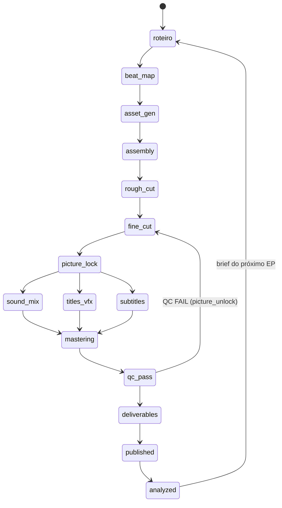

# Session agent-a8d183ebd77232479
**Date:** 2026-08-05 | **Session ID:** `agent-a8d183ebd77232479`

---

## 👤 User *(00:25:09)*

Monte o manual único **Repertório Profissional de Produção — MCORCH** a partir das seções
abaixo. Não resuma: PRESERVE a densidade técnica de cada uma, elimine só repetição entre elas, e ordene em
VFX/Imagem → Áudio → Workflow → Gramática de Prompt. Abra com um índice e uma seção curta "Como usar este manual"
(quem consulta o quê: o agente do chat ao montar cena, o diretor criativo ao produzir, o engenheiro ao codar nó).

Depois, produza `quick_rules`: 12 a 18 regras CURTAS e imperativas (uma linha cada) destiladas do manual inteiro,
escritas para ir dentro do system prompt de um agente de IA — o tipo de regra que muda a saída dele na prática
(ex.: "Todo prompt de vídeo declara lente, movimento de câmera e fonte de luz — nessa ordem").

SEÇÕES:

===== vfx =====
## VFX e Imagem

> Escopo desta seção: vocabulário de VFX aplicado ao pipeline real do MCORCH (motion HTML/Playwright/FFmpeg · Veo 3.1 · Nano Banana · IVC/Qwen3 · Lyria · whisper.cpp). Toda receita abaixo foi verificada no host de produção — `ffmpeg 6.1.1 (arm64, gpl, libvidstab/libplacebo/frei0r/librsvg/zimg)`, `OpenCV 5.0.0`, `numpy 2.4.6`, `Pillow 12.2.0`, Playwright/Chromium. O que **não** existe aqui está declarado no ledger final.

### 0. Regra de casa — economia de pixel antes de qualquer filtro

A doutrina "gere pouco, reuse muito" tem uma tradução literal em VFX: **todo pixel corrigível em FFmpeg/CSS custa 0 mco; todo pixel corrigível apenas re-gerando custa 267 mco (Veo) ou 10 mco (Nano)**. Antes de pedir retake, pergunte três coisas nesta ordem:

1. Dá para resolver na **cor** (grade/correction)? → FFmpeg, 0 mco.
2. Dá para resolver na **composição** (crop, reframe, overlay, matte, tracking)? → FFmpeg + camada alpha do motion engine, 0 mco.
3. Só então: retake. E se for retake, mude o **prompt**, não a sorte.

Mapa de origem por camada — quem gera o quê, com que limitação estrutural:

| Camada | Motor | Custo | Entrega alpha? | Limite estrutural que dita o VFX |
|---|---|---|---|---|
| Grafismo / UI / cena-conceito | motion engine (`scripts/motion/scene-template.ts` + `render-frames.mjs`) | 0 | **Sim** (`omitBackground: true` → PNG RGBA) | determinístico por `__seek(t)`; sem rAF, sem transição CSS temporal, ZERO CDN |
| Humano falando | Veo 3.1 | 267 mco / 8s | Não | 4:2:0 comprimido, sem canal alpha, sem controle de câmera pós-fato |
| Still / textura / b-roll | Nano Banana | 10 mco | Não | **sempre 1:1** — reframe é problema seu |
| Overlay de texto/legenda | HyperFrames alpha (`renderAlphaFrames`, `scripts/hyperframes/render-core.ts`) | 0 | **Sim** | `-pix_fmt yuv420p` mata alpha — nunca encode a camada, faça overlay direto da sequência |
| Montagem / cor / grão / key | FFmpeg 6.1.1 | 0 | n/a | é aqui que 90% do "acabamento" deve morar |

---

### 1. CGI (Computer-Generated Imagery)

**(a) O que é de verdade.** No mundo profissional, "CGI" quase nunca significa "personagem 3D fotorrealista". Significa *pixel que não veio de uma câmera*: HUD, gráfico animado, extensão de cenário, partícula, lettering 3D, superfície de vidro, screen replacement. O trabalho real do artista de CGI é **fazer o elemento sintético obedecer às mesmas leis físicas do plate** — mesma perspectiva, mesma luz-chave, mesmo grão, mesmo motion blur, mesma resposta de lente. Quem entrega CGI que "flutua" errou nessas cinco coisas, não no modelo.

**(b) No MCORCH.** Nosso CGI é o **motion engine**: cards glass 3D, anel de perímetro, arestas vivas, galáxia, partículas, contadores. Ele já é CGI-grade em três aspectos que times grandes erram: é **determinístico** (frame N idêntico em qualquer máquina — `window.__seek(t)` é matemática pura, não `requestAnimationFrame`), é **hierarquicamente coerente** (as arestas são recalculadas por frame com as *mesmas* funções de float dos nós que ligam — ou seja, o "rig" é fonte única, não duas animações que torcem para bater), e é **de custo zero**. A regra selada do anel — perímetro via `stroke-dashoffset`, **nunca** `rotate` num retângulo com `conic-gradient` — é exatamente a disciplina de CGI: o elemento tem que seguir a geometria do objeto, não fingir que segue.

**(c) Hoje vs. ferramenta nova.**
- **Hoje (0 mco):** tudo que é 2.5D — `transform: perspective(900px) rotateX(...) translateZ(...)`, `backdrop-filter: blur(14px) saturate(1.3)` para vidro, `mix-blend-mode: screen` para bloom/aberração, SVG `stroke-dasharray/dashoffset` para trajetos, partículas em DOM/canvas 2D. WebGL/three.js roda em Chromium headless e é seek-ável se você dirigir o clock manualmente (`renderer.render()` por frame em vez de loop) — mas **isso ainda não está no template**; adotar exige portar o padrão `__seek(t)` para o loop do three.
- **Ferramenta nova obrigatória:** 3D real com raytracing, simulação de fluido/partícula com solver, cabelo/pano, câmera com solve 3D. Isso é Blender headless (`blender -b -f <frame>`) — **não instalado**, e o custo real não é o binário, é o tempo de render em CPU ARM sem GPU. Antes de propor, calcule o minuto/frame.

**(d) Instrução exemplo.**
> "Cena-conceito 16:9, 9s, fundo galáxia desde t=0. CGI: três nós glass (Roteiro → Imagem → Vídeo) entrando nos beats 'roteiro', 'imagem' e 'vídeo' da narração; **o anel de progresso percorre o perímetro do card via `stroke-dashoffset`, não rotaciona**; as arestas são recalculadas por frame a partir das mesmas funções de float dos nós, com atraso de 2 frames para dar peso. Bloom só no beat 'vídeo' (`mix-blend-mode: screen`, opacidade 0 → 0.35 → 0). Sem CDN, sem rAF: tudo determinístico em `__seek(t)`."

---

### 2. Compositing

**(a) O que é de verdade.** Compositing é a arte de fazer N camadas de origens diferentes parecerem uma única fotografia. O trabalho concreto: ordem de camadas, operações de blend (`over`, `screen`, `add`, `multiply`), gestão de canal alpha (premultiplicado vs. straight), *edge treatment* (o pixel da borda é o que denuncia o comp), e **unificação** — grão, cor, blur e ruído aplicados **depois** do merge, sobre o comp inteiro, para que o elemento colado herde os defeitos do plate. Compositor sênior gasta 20% do tempo colando e 80% "sujando" o que colou.

**(b) No MCORCH.** O comp canônico já roda em produção no assemble do EP05: take limpo → `scale/crop` → PiP dentro da moldura HUD → overlay do callout com alpha → base. Repare no encadeamento real usado:

```
[0:v]scale=1354:762,crop=1280:720:x='(iw-ow)*min(t/8,1)':y=(ih-oh)/2,tpad=stop_mode=clone:stop_duration=30,scale=998:562,fps=30[pip];
[1:v][pip]overlay=141:79[b1];
[b1][2:v]overlay=0:0[b2];
[b2][3:v]overlay=x='min(0,-640+t*640)':y=560:enable='lt(t,5.4)'[vout]
```

Camadas: nebulosa de fundo (loop) → PiP com Ken Burns → moldura HUD PNG → callout PNG que desliza e sai. Isso é comp de verdade, só que declarado em `filter_complex`.

**(c) Hoje vs. ferramenta nova.**
- **Hoje (0 mco):** `overlay` (com `enable=` para gating temporal e expressões em `x`/`y` para animação), `blend=all_mode=screen|multiply|overlay|softlight`, `maskedmerge` (base, over, máscara), `alphamerge`/`alphaextract`, `premultiply`/`unpremultiply`, `xfade` para transições. A camada gráfica sai do Playwright como **sequência PNG RGBA** (`page.screenshot({ omitBackground: true })`) e entra direto no `overlay` — **nunca** passe por um MP4 intermediário: `-pix_fmt yuv420p` descarta o alpha em silêncio. Se precisar mesmo de um arquivo com alpha, use `-c:v qtrle` (.mov) ou `-c:v prores_ks -pix_fmt yuva444p10le` — ambos presentes no build.
- **Ferramenta nova:** node graph interativo (Nuke/Fusion), deep compositing, keyer com edge-extend. Não temos e, na escala de 2 vídeos/semana, não compensa.

**(d) Instrução exemplo.**
> "Comp da cena 26: plate = take Veo `p26.mp4`. Sobre ele, camada alpha do motion engine (callout 'Imagem → Vídeo', 1080×1920, `omitBackground`) entrando por `overlay=x='min(48, -400+t*900)':y=1180:enable='between(t,1.2,6.4)'`. **Unificação depois do merge**: `noise=c0s=6:c0f=t+u` e `eq=saturation=0.97` aplicados no comp inteiro, não na camada. Nada de encode intermediário com alpha — o overlay lê a sequência `f_%05d.png` direto."

---

### 3. Rotoscopia

**(a) O que é de verdade.** Roto é desenhar/propagar máscara em conteúdo que **não** pode ser chaveado — porque não tem fundo cromático, ou porque o key falhou no cabelo, na borda desfocada, na fumaça. Na prática profissional: você não roto o objeto inteiro; você roto **por partes articuladas** (braço, torso, cabeça), em **keyframes esparsos** com propagação, e trata separadamente as regiões de *motion blur* (que não têm borda dura, têm gradiente de alpha). Roto ruim = borda "de tesoura", pulsando frame a frame. Roto é o trabalho mais caro do VFX — a decisão sênior é quase sempre **evitá-lo**.

**(b) No MCORCH.** Onde o roto apareceria: recortar o apresentador Veo do fundo para colá-lo sobre nosso grafismo. **Não faça.** Veo entrega 8s por 267 mco com áudio nativo e o fundo já é dirigível por prompt — recortar um sujeito de vídeo 4:2:0 comprimido é queimar horas para produzir borda ruim. A resposta correta é pedir o fundo certo no prompt e compor **por região da tela** (apresentador de um lado, grafismo do outro, split determinístico) em vez de por silhueta. Roto legítimo no nosso contexto: mascarar um retângulo de UI num screencast (dado sensível, elemento desatualizado) — e isso é máscara geométrica, não roto de silhueta.

**(c) Hoje vs. ferramenta nova.**
- **Hoje (0 mco), máscara geométrica animada:** gere a máscara como **camada alpha do próprio motion engine** (um `div` branco com `border-radius` e `transform` animado por `__seek(t)`) e combine com `alphamerge`/`maskedmerge`. É determinístico, versionável em código, e infinitamente melhor que desenhar spline.
- **Hoje (0 mco), roto assistido por CV:** `cv2.grabCut` num keyframe + propagação por `cv2.calcOpticalFlowPyrLK` → escreve `mask_%05d.png` (grayscale) → `[base][mask]alphamerge` → `overlay`. Serve para objeto rígido/lento. **Não** serve para cabelo/borda desfocada.
- **Ferramenta nova:** segmentação neural (SAM 2, RobustVideoMatting). `rembg`/SAM **não estão instalados**; o `cv2.dnn` existe e poderia rodar um ONNX, mas isso é dependência + download de modelo + validação de licença — declare como projeto, não como "dá pra fazer hoje".

**(d) Instrução exemplo.**
> "Ocultar o painel de chaves de API no screencast `sc_gen.mp4` entre 00:04.2 e 00:09.8. **Não é roto de silhueta** — é máscara geométrica: retângulo animado renderizado como camada alpha do motion engine seguindo o pan, aplicado com `maskedmerge` sobre uma cópia `gblur=sigma=28` do próprio plate (borrar, não tapar com bloco preto — bloco preto denuncia edição, borrão parece decisão de design)."

---

### 4. Chroma Key

**(a) O que é de verdade.** Chroma key é extrair alpha a partir de uma dominante cromática. Os três parâmetros que importam são sempre os mesmos, em qualquer software: **tolerância** (quanto do espaço de cor vira transparente), **blend/softness** (quão gradual é a transição na borda) e **despill** (remover a luz verde que *reflete* no sujeito — sem despill o cabelo fica com halo, a pele fica esverdeada e todo mundo percebe, mesmo sem saber nomear). Sênior faz key em **duas passadas**: um core matte agressivo (interior 100% opaco) e um edge matte suave, combinados — nunca um único key tentando servir aos dois.

**(b) No MCORCH.** Uso legítimo hoje: **não** para o Veo (fundo 4:2:0 comprimido não chaveia bem, e re-gerar com o fundo certo custa 1 take), mas para **assets de terceiros com fundo chapado** e para stills do Nano Banana onde você pediu explicitamente fundo sólido saturado. Também vale como *fallback* quando você recebe material pronto que já veio chavaeável.

**(c) Hoje vs. ferramenta nova.** Tudo disponível no FFmpeg 6.1.1 — verificado neste host:

```bash
ffmpeg -y -i plate_verde.mp4 \
  -vf "chromakey=color=0x00d000:similarity=0.30:blend=0.05,\
       despill=type=green:mix=0.5:expand=0.2,format=rgba" \
  -c:v qtrle keyed.mov
```

- `chromakey` opera em **YUV** (melhor para vídeo); `colorkey` opera em **RGB** (melhor para grafismo com cor exata); `lumakey` para fundo preto/branco puro.
- `despill` é filtro de primeira classe aqui (`type`, `mix`, `expand`, `brightness`, `alpha`) — **use sempre**, nunca entregue key sem despill.
- Erode/expand da borda: `erosion`/`dilation` no canal alpha isolado (`alphaextract` → filtro → `alphamerge`).
- **Ferramenta nova:** keyer com edge-extend/light-wrap real (IBK do Nuke). O substituto barato aqui é *light wrap* manual no comp: duplicar o fundo, `gblur=sigma=24`, `blend=all_mode=screen` restrito à borda via máscara — funciona e custa 0.

**(d) Instrução exemplo.**
> "Chaveie `stock_apresentador.mp4` (fundo #00D000): `chromakey=color=0x00d000:similarity=0.30:blend=0.05` seguido de `despill=type=green:mix=0.5:expand=0.2`. Depois do merge sobre a galáxia, aplique light wrap: cópia do fundo com `gblur=sigma=24` em `blend=all_mode=screen` limitado à borda do matte. Saída intermediária em `qtrle` — `yuv420p` apagaria o alpha."

---

### 5. Motion Tracking

**(a) O que é de verdade.** Tracking é recuperar o movimento de algo no plate para que um elemento novo herde esse movimento (*match-move*). Sabores: 1 ponto (posição), 2 pontos (posição+escala+rotação), 4 pontos/planar (perspectiva — o "corner pin" que troca a tela de um notebook), câmera 3D (solve completo). O trabalho real é escolher **features que sobrevivem** (alto contraste, sem oclusão, sem repetição de padrão) e saber quando o track derrapou. O tracker sempre entrega números; cabe a você desconfiar deles.

**(b) No MCORCH.** Aqui está a inversão que vale a seção inteira: **no motion engine nós não trackeamos, nós compartilhamos a fonte**. As arestas seguem os nós porque leem a *mesma função de posição*, por frame. Isso é match-move perfeito por construção, com erro zero, custo zero e zero solve. Sempre que um elemento precisar seguir outro numa cena nossa, a resposta é "derive da mesma equação", nunca "trackeie depois".

Tracking de verdade só é necessário quando o movimento nasceu fora do nosso controle: take Veo (câmera dirigida pelo modelo) e screencast (pan/scroll do operador). Nesses casos:

**(c) Hoje vs. ferramenta nova.**
- **Hoje, sem solve (preferencial):** o pan do screencast é *nosso* — `zoompan`/`crop` com expressão em `t` são determinísticos, então qualquer overlay pode usar **a mesma expressão** e grudar. Exatamente o que o assemble faz: `crop=...x='(iw-ow)*min(t/D,1)'` e o callout entra com `overlay=x='min(0,-640+t*640)'`.
- **Hoje, com solve 2D (0 mco, sem instalar nada):** OpenCV 5.0 no host — `goodFeaturesToTrack` + `calcOpticalFlowPyrLK` (Lucas-Kanade piramidal) + `estimateAffinePartial2D` dá posição/escala/rotação por frame; `findTransformECC` dá alinhamento global (bom para stabilize/match de plate); `matchTemplate` resolve patch rígido. Exporte para JSON e converta em expressões `overlay=x='...'` ou em `sendcmd`.
  ⚠️ Nota de materialidade: neste build do OpenCV **não existem** `cv2.TrackerCSRT` nem `cv2.legacy` (verificado) — não escreva script assumindo os trackers "de caixinha".
- **Hoje, estabilização:** `vidstabdetect` (passo 1) + `vidstabtransform` (passo 2) — `libvidstab` está compilado. `deshake` para caso rápido.
- **Ferramenta nova:** planar tracker robusto e camera solve 3D. Não temos. Se o plano exige corner-pin numa superfície que gira em perspectiva, **mude o plano**.

**(d) Instrução exemplo.**
> "O rótulo 'custo: 0 mco' precisa grudar no card do nó durante a cena. **Não trackeie**: o rótulo é filho do mesmo objeto no template e lê `nodePos(i, t)`, a mesma função que posiciona o card e origina as arestas. Se o mesmo rótulo precisar grudar no take Veo `p14.mp4` (onde a câmera é do modelo), aí sim: LK sobre 12 features no terço inferior, `estimateAffinePartial2D` por frame, exportar `track.json` e emitir `overlay` com `x`/`y` interpolados — e revisar o track num contact sheet antes de aceitar."

---

### 6. Color Correction

**(a) O que é de verdade.** Correction é o passo **técnico e neutro**: acertar exposição, balanço de branco, contraste, e — decisivo em pipeline misto — **fazer todos os planos baterem entre si** (*match*). Não tem intenção estética; tem alvo objetivo. As ferramentas mentais são: waveform (exposição/clipping), vetorscópio (dominante e saturação), skin tone line. Corrigir é o que garante que o grade não vai amplificar erro.

**(b) No MCORCH.** Este é o passo **obrigatório e hoje subatendido**: nossos planos vêm de quatro fontes com colorimetrias diferentes — Veo (vídeo tratado, contraste próprio), Nano Banana (still com gamma de gerador de imagem), screencast (RGB full-range do navegador), motion engine (RGB full-range do Chromium, ciano/azul saturado por design). Emendar isso sem correction produz o defeito clássico: o corte do motion para o Veo "estoura" e o corte do Veo para o screencast "lava".

Duas armadilhas técnicas específicas nossas:
- **Full-range vs. limited-range.** PNG do Chromium é RGB full (0–255). Se você joga direto no `libx264` sem declarar, o preto levanta ou o branco clipa. A conversão correta e o *tagging* (verificados neste host):

```bash
ffmpeg -y -framerate 30 -i f_%05d.png \
  -vf "scale=1920:1080:flags=lanczos:in_range=full:out_range=limited,format=yuv420p" \
  -colorspace bt709 -color_primaries bt709 -color_trc bt709 -color_range tv \
  -c:v libx264 -crf 16 -preset slow motion_scene.mp4
# ffprobe → tv,bt709,bt709,bt709
```

  Sem esse tagging, o YouTube adivinha — e adivinha errado em material sintético saturado.
- **Ordem.** Correction **antes** do grade e antes do grão. Grão sobre imagem já corrigida é grão; grão antes da correção vira ruído amplificado.

**(c) Hoje vs. ferramenta nova.** 100% FFmpeg, tudo presente:
- `eq=contrast=1.06:brightness=0.01:saturation=0.98:gamma=1.02` — ajuste global rápido.
- `colorbalance=rs=..:gs=..:bs=..:rm=..:gm=..:bm=..:rh=..:gh=..:bh=..` — lift/gamma/gain por faixa (sombras/médios/altas). É o seu "3-way".
- `colorlevels=rimin=0.02:rimax=0.96:...` — pontos de preto/branco por canal (o "levels").
- `curves=master='0/0 0.25/0.22 0.75/0.78 1/1'` (ou `r=`/`g=`/`b=`) — a ferramenta mais precisa que temos.
- `colortemperature=temperature=6200:mix=0.8` e `colorcorrect=rl=..:bl=..:rh=..:bh=..` — balanço de branco em sombras/altas.
- `vibrance=intensity=0.15` (satura o que está fraco sem estourar pele) e `selectivecolor` (CMYK por faixa) para o cirúrgico.
- Diagnóstico sem GUI: `-vf waveform` / `-vf vectorscope` renderizados num PNG e lidos pelo Vision QA — é o nosso "scope".
- **Ferramenta nova:** nada. Se você está pedindo Resolve para correction aqui, o problema é processo, não ferramenta.

**(d) Instrução exemplo.**
> "Antes de qualquer look: normalize os 4 pipelines para BT.709 limited com tagging explícito. Match do screencast contra o take Veo da cena 25 (referência): screencast está +6% em luma média e frio em ~350K. Aplique `colortemperature=temperature=6200:mix=0.7,eq=contrast=1.04:brightness=-0.02,colorlevels=rimin=0.015:gimin=0.015:bimin=0.02`. Valide extraindo o frame do último frame do screencast e o primeiro do Veo lado a lado num contact sheet — o corte não pode 'piscar' em exposição."

---

### 7. Color Grading

**(a) O que é de verdade.** Grade é **intenção**: construir o look que carrega tom emocional e identidade de marca — split-toning (sombras frias / altas quentes), curva de contraste com roll-off (não deixar clipar duro), redução seletiva de saturação para deixar um acento respirar, densidade nos cantos. Grade profissional é *consistente* e *reprodutível*: vira LUT, vira preset, vira parte da marca. E grade nunca conserta erro — grade sobre plano mal corrigido amplifica o erro.

**(b) No MCORCH.** O nosso look já existe de fato, só não estava escrito: base quase-preta azulada (`#05060a`), acento ciano (`#57e2ff`), brilho por `text-shadow`/`radial-gradient`, vinheta, grão sutil. **A ação correta é congelar isso num LUT `.cube` versionado no repo** e aplicá-lo como último passo de imagem em *todo* plano — inclusive nos takes Veo e nos screencasts. É assim que o canal ganha assinatura visual: o espectador reconhece o vídeo pelo look antes de ler o título. Custo: 0.

**(c) Hoje vs. ferramenta nova.** LUT 3D é nativo (`lut3d`) e você não precisa de software de grade para **fabricar** o `.cube` — gere por script (verificado neste host):

```python
# scripts/motion/lut/build-mcorch-look.py  → mcorch_teal_v1.cube (17³)
N = 17
out = ["TITLE \"mcorch_teal_v1\"", f"LUT_3D_SIZE {N}"]
for b in range(N):
  for g in range(N):
    for r in range(N):
      R, G, B = r/(N-1), g/(N-1), b/(N-1)
      R2 = min(1, max(0, R*1.02 - 0.006))          # sombras levemente frias
      G2 = min(1, max(0, G + 0.008*(1-G)**2))
      B2 = min(1, max(0, B*0.99 + 0.030*(1-B)**2)) # lift teal nas sombras
      out.append(f"{R2:.6f} {G2:.6f} {B2:.6f}")
open("mcorch_teal_v1.cube","w").write("\n".join(out) + "\n")
```

```bash
ffmpeg -y -i plano.mp4 -vf "lut3d=file=lut/mcorch_teal_v1.cube:interp=tetrahedral" -c:v libx264 -crf 16 graded.mp4
```

Complementos válidos no mesmo passo: `curves` para o roll-off de altas, `vibrance` no lugar de `eq=saturation` (preserva pele), `vignette=PI/5` quando o plano não vier do motion engine (que já tem vinheta em CSS — **não aplique duas vezes**).
- **Ferramenta nova:** nenhuma para aplicar. Para *desenhar* o look com scopes interativos, um humano num Resolve/Lightroom ajuda — mas o entregável final continua sendo o `.cube` versionado.

**(d) Instrução exemplo.**
> "Sele o look do canal como `lut/mcorch_teal_v1.cube` (17³, interp tetrahedral): lift teal nas sombras (+0.030 em B na faixa baixa), highlights neutros com roll-off, saturação global −3% e `vibrance=+0.15` para não matar pele nos takes Veo. Aplique como **último** filtro de imagem em todos os planos, depois da correction e antes do grão. Nos planos vindos do motion engine, desligue a vinheta CSS ou o `vignette` do FFmpeg — nunca as duas."

---

### 8. Matte, alpha e premultiplicação

**(a)** *Matte* é a imagem em tons de cinza que define opacidade; *alpha* é esse matte já acoplado ao pixel. A distinção que quebra comps: **straight** (RGB independente do alpha) vs. **premultiplied** (RGB já multiplicado pelo alpha). Colar premultiplicado como se fosse straight → halo escuro na borda; o inverso → halo claro. **(b)** Chromium com `omitBackground: true` entrega **PNG straight** — que é o que o `overlay` do FFmpeg espera. Por isso o pipeline atual funciona sem gambiarra. **(c)** Hoje: `alphaextract` (ver o matte), `alphamerge` (colar matte em plate), `premultiply`/`unpremultiply` (converter quando o asset vier de terceiro), `erosion`/`dilation` no matte isolado para tratar borda. **(d)** Instrução: *"O asset chegou com halo escuro na borda — é premultiplicado. `alphaextract` para inspecionar, `unpremultiply` antes do `overlay`, e erode 1px no matte antes de recompor."*

### 9. LUT (.cube) e look pipeline

**(a)** LUT é a materialização reprodutível de um look. Ordem industrial: *technical LUT* (conversão de espaço) → *creative LUT* (look) → trims por plano. LUT não corrige exposição — LUT aplicada em plano mal exposto produz banding e cor quebrada. **(b)** Nosso `lut/mcorch_teal_v1.cube` é ativo de marca: versionado, com nota de qual episódio estreou, e obrigatório nos 4 pipelines. **(c)** Hoje: `lut3d=file=...:interp=tetrahedral` (nativo), geração por script Python. Novo: nada. **(d)** *"Nunca aplique `mcorch_teal_v1` antes da correction; e se o plano precisar de trim, faça `curves` **depois** da LUT, jamais editando o `.cube` para um plano só."*

### 10. Key light e o esquema de três pontos (vocabulário de prompt)

**(a)** Key (fonte principal, define modelagem e sombra), fill (levanta a sombra, define razão de contraste), rim/back (separa sujeito do fundo). Direção, altura, dureza e razão key:fill são o que um diretor de fotografia realmente comunica. **(b)** É o vocabulário que **faz o Veo e o Nano obedecerem**. Prompt com "bonito, cinematográfico" produz ruído; prompt com "key a 45° pela esquerda, razão 4:1, rim ciano" produz plano dirigível — e, o mais importante, **reproduzível entre takes**, que é como se mantém continuidade sem gastar retake. **(c)** Hoje: só via prompt (não temos relight pós-fato). Um "fake rim" é possível no comp (duplicar borda mascarada + `blend=screen`), mas é remendo. **(d)** *"Take 8s, plano médio, key suave a 45° pela esquerda em 5600K, fill 4:1, rim ciano (#57e2ff) pela direita alta separando do fundo escuro; fundo galáxia desfocada, sem texto, sem UI. Câmera estática, lente 50mm, altura dos olhos."*

### 11. Depth of field, bokeh e plano focal

**(a)** DoF não é "borrar o fundo" — é escolher onde o olho pousa. Profissional pensa em plano focal, profundidade de campo e transição (o *falloff*). Bokeh é a *forma* do desfoque (o círculo de confusão da lente), não a quantidade. **(b)** Nos nossos planos, DoF resolve o problema de leitura: cena com 3 cards e narração falando de um → os outros dois recuam. **(c)** Hoje, no motion engine (0 mco): `filter: blur(Npx)` animado por `__seek(t)` + `opacity` + escala — DoF por camada, exatamente como comp 2.5D real. No FFmpeg: `gblur=sigma=` com máscara via `maskedmerge` para DoF por região; `boxblur` quando quiser bokeh mais "chapado". No Veo: **só por prompt**, não é editável depois. **(d)** *"Nos beats 2 e 3, os cards fora de foco vão para `filter: blur(6px)` e `opacity: .55` em 12 frames com easing; o card ativo permanece em `blur(0)`. Nada de `gblur` no FFmpeg aqui — o DoF é por camada, no template, senão borra o texto do card ativo junto."*

### 12. Lens flare, bloom, halação e glow

**(a)** Bloom é o vazamento de luz de áreas superbrilhantes no sensor/olho; halação é o vermelho característico ao redor de altas luzes em filme; flare é reflexo interno da lente. São **artefatos de captura** — usá-los é dizer "isto foi fotografado". Excesso é a assinatura número 1 de amador. **(b)** Já temos bloom no template (`#bloom`, `mix-blend-mode: screen`, `radial-gradient`) e aberração cromática nas bordas — a disciplina é **acionar por beat**, não deixar ligado o tempo todo. **(c)** Hoje, CSS: `mix-blend-mode: screen` + `radial-gradient` + `filter: blur()`. Hoje, FFmpeg (para planos que não são nossos): pseudo-bloom em uma passada — `split` → `gblur=sigma=30` → `blend=all_mode=screen:all_opacity=0.35` de volta no original; halação = mesma coisa com `colorchannelmixer` puxando vermelho na cópia borrada. Flare procedural com movimento: só como camada alpha do motion engine. **(d)** *"Bloom só no frame em que o nó 'Vídeo' completa o anel: `#bloom` de `opacity: 0 → .32 → 0` em 10 frames. Aberração cromática permanece em `.5` constante (é textura de lente, não evento). Nada de flare — o canal é documentário informativo, não trailer."*

### 13. Motion blur e shutter angle

**(a)** Shutter angle (180° = exposição de meio frame) determina quanto borrão o movimento deixa. CGI sem motion blur parece videogame; com blur demais, parece sujo. É o parâmetro que mais aproxima grafismo de imagem filmada. **(b)** Nosso motion engine renderiza **sem motion blur** — cada frame é um instante matemático perfeito. Em movimento rápido (card entrando, aresta disparando), isso lê como "estroboscópico". **(c) Hoje (0 mco, e é a técnica certa):** como `__seek(t)` é contínuo, renderize a **3× o fps** e acumule:

```bash
node scripts/motion/render-frames.mjs scene.html frames/ 810 1920 1080 90   # 9s @ 90fps
ffmpeg -y -framerate 90 -i frames/f_%05d.png \
  -vf "tmix=frames=3:weights='1 1 1',fps=30,scale=in_range=full:out_range=limited,format=yuv420p" \
  -c:v libx264 -crf 16 scene_mb.mp4     # ≈180° de shutter
```

  Custo: 3× o tempo de screenshot (não de dinheiro). `weights='1 1 1'` = 180°; `frames=5` a 150fps aproxima 360°. Alternativa mais barata e pior: `minterpolate=mi_mode=mci` (interpola, mas inventa — pode gerar artefato em texto). **(d)** *"Cenas com entrada rápida de card renderizam a 90fps e colapsam com `tmix=frames=3,fps=30` (shutter ~180°). Cenas contemplativas ficam a 30fps nativo — motion blur em cena parada só custa render."*

### 14. Grão, dither e banding

**(a)** Grão faz duas coisas: dá textura orgânica e **esconde banding** quebrando o degradê com ruído. Banding aparece onde há gradiente amplo e suave — exatamente o nosso caso (`filter: blur(70px)` nas blobs da galáxia, `radial-gradient` da vinheta). **(b)** O template já tem grão CSS (`opacity: .055`, padrão de 3px). O que falta é a defesa **no encode**, onde o banding realmente nasce. **(c)** Hoje: grão temporal só na luma — `noise=c0s=6:c0f=t+u` (o `t` faz variar por frame; grão estático parece sujeira na lente); `-crf 16` ou menos nos masters de cena; intermediários em 10-bit (`-pix_fmt yuv420p10le` com `libx264` — **verificado neste build**) para os planos com muita galáxia; `zscale=d=error_diffusion` como dither na descida para 8-bit. Regra: **grão por último**, depois da LUT — grão antes da LUT é grão colorido errado. **(d)** *"O céu da cena 12 está com banding no degradê. Master de cena em `-pix_fmt yuv420p10le -crf 14`, dither com `zscale=d=error_diffusion` na descida para 8-bit, e `noise=c0s=6:c0f=t+u` depois da LUT. Se o grão CSS do template estiver ligado, baixe para .03 — dois grãos somam e viram ruído."*

### 15. Reframe, clean plate e set extension (o problema do 1:1)

**(a)** *Clean plate* é a placa sem o elemento (para apagar/estender); *set extension* é ampliar o cenário além do que foi capturado. Em produção moderna, é isso que resolve enquadramento errado sem retake. **(b)** Nosso caso concreto e diário: **Nano Banana sempre devolve 1:1** e o canal entrega 16:9 (e 9:16 nos cortes). Três estratégias, em ordem de qualidade:
1. **Prompt com headroom** (grátis, melhor): componha o sujeito no centro com margem, sabendo que 16:9 vai cortar topo e base — o enquadramento nasce compatível.
2. **Pan/scan animado** (`zoompan`, já usado no `encodeKenBurns`): transforma a limitação em movimento. Lembre do truque anti-jitter já documentado — upscale 2× antes do `zoompan`.
3. **Pillar-blur** (verificado neste host) quando o conteúdo não pode ser cortado:
```bash
ffmpeg -y -loop 1 -t 6 -i still_1x1.png -filter_complex \
 "[0:v]split=2[bg][fg];\
  [bg]scale=1920:1080:force_original_aspect_ratio=increase,crop=1920:1080,gblur=sigma=40,eq=brightness=-0.10:saturation=0.55[bgb];\
  [fg]scale=-1:1080[fgs];[bgb][fgs]overlay=(W-w)/2:0,fps=30,setsar=1[v]" \
 -map "[v]" -c:v libx264 -crf 18 -pix_fmt yuv420p reframe.mp4
```
**(c)** Novo: *outpainting* generativo (estender o 1:1 para 16:9 com pixel novo) — não temos localmente; exigiria chamada de imagem adicional (10 mco) e ainda assim sem garantia de continuidade. `cv2.inpaint` e `cv2.seamlessClone` existem e servem para remover objeto pequeno / clean plate simples, **não** para extensão de cenário. **(d)** *"Still da cena 31 é 1:1 e precisa virar 16:9 sem perder o topo do gráfico: pillar-blur com o próprio still (sigma 40, −10% brilho, 55% saturação no fundo) e Ken Burns leve de 1.0→1.08 no primeiro plano. Não re-gere no Nano — 10 mco por um problema de enquadramento é desperdício."*

---

### 16. Gate de QA de VFX (obrigatório antes de declarar plano pronto)

O QA existente (Vision sobre frames/contact sheet + whisper.cpp timestampado na mesma timeline) cobre narrativa e sync. Para VFX, acrescente cinco checagens **materiais** — cada uma com prova, não com opinião:

| # | Checagem | Prova |
|---|---|---|
| 1 | Tagging de cor correto no master | `ffprobe -show_entries stream=color_range,color_space,color_primaries,color_transfer` → `tv,bt709,bt709,bt709` |
| 2 | Sem clipping nos cortes entre motores | frame final do plano N + frame inicial do N+1 no mesmo contact sheet; `-vf waveform` renderizado em PNG e lido pelo Vision |
| 3 | Borda de comp sem halo | crop 200×200 na borda do elemento colado, ampliado 4×, no contact sheet |
| 4 | Grão/vinheta não duplicados | grep no template por `#grain`/`.vig` **e** no comando FFmpeg por `noise=`/`vignette=`; os dois ligados = defeito |
| 5 | Determinismo mantido | re-render de 3 frames aleatórios e `sha256sum` idêntico ao master (NFR-VS-016) |

---

### 17. Ledger de honestidade — o que este pipeline NÃO faz hoje

Declarado explicitamente para que ninguém prometa ao Sovereign o que não existe:

- **Não temos** 3D real (Blender não instalado), raytracing, simulação de fluido/pano/cabelo.
- **Não temos** ImageMagick (`convert` ausente) — todo processamento de still é FFmpeg, Pillow ou Playwright.
- **Não temos** segmentação neural (`rembg`/SAM não instalados) → roto de silhueta em vídeo real é projeto, não tarefa.
- **Não temos** os trackers de caixinha do OpenCV neste build (`cv2.TrackerCSRT` e `cv2.legacy` ausentes) → tracking = LK/ECC/`matchTemplate` escritos à mão.
- **Não temos** planar tracker nem camera solve 3D → corner-pin em superfície girando em perspectiva: mude o plano.
- **Não temos** outpainting generativo local → o 1:1 do Nano se resolve por prompt, pan/scan ou pillar-blur.
- **Não temos** relight, nem controle de câmera pós-fato nos takes Veo → luz e lente se decidem no prompt, e o custo do erro é 267 mco.
- **Alpha nunca sobrevive a `yuv420p`** — se o comando tem `-pix_fmt yuv420p` numa camada com transparência, o comp já está errado antes de rodar.

**Regra final, que resume a seção:** o acabamento do MCORCH mora na camada de custo zero. Correção, look, grão, blur, comp, máscara, motion blur e reframe são todos FFmpeg/CSS/Playwright. O motor pago (Veo, Nano) serve para gerar **conteúdo que não podemos sintetizar** — nunca para consertar o que uma linha de `filter_complex` resolve.


===== audio =====
## Áudio e Desenho Sonoro

> Doutrina de som do MCORCH. Todas as receitas abaixo foram executadas no host (`ffmpeg 6.1.1-3ubuntu5`) antes de entrarem neste manual — os números citados são medições, não estimativas (Lei 1). Referências vivas: `scripts/ep05/assemble-v13.ts` (cadeia de mix real do MASTER A13), `scripts/ep05/ep05-trilha-v2.py` (Lyria por ato), `.claude/skills/motion-scenes/SKILL.md` (passo 5 = mix).

### O inventário sonoro real (e os buracos declarados)

Antes de qualquer receita, o que a casa **tem** e o que **não tem** — porque metade dos erros de som aqui nasce de assumir uma capacidade inexistente.

| Fonte | O que entrega | Natureza do stem |
|---|---|---|
| Motor de motion (`scripts/motion/scene-template.ts` + frame-seek) | **Vídeo mudo por construção** — HTML+Playwright não produzem áudio | nenhum |
| Veo 3.1 (267 mco/take 8s) | Fala + ambiência + foley do modelo, **colados no take** | stem ÚNICO, não separável |
| ElevenLabs IVC / Qwen3-TTS local | Diálogo limpo, seco, anecoico (sem sala) | stem limpo, reposicionável |
| Lyria RealTime | **Música por ato**. Não gera SFX, não gera ambiência, não gera wallah | stem musical |
| whisper.cpp local (`/home/ubuntu/.mcorch/asr-engine/whisper.cpp/build/bin/whisper-cli`, modelo `ggml-large-v3-turbo-q5_0.bin`) | Transcrição timestampada — instrumento de precisão para J/L cut e gate de inteligibilidade | ferramenta de medição |

**Buracos verificados (não prometa o que não existe):**

- **Não há biblioteca de SFX/foley no repo.** Duas saídas legítimas: (1) **sintetizar no FFmpeg** (`anoisesrc`/`aevalsrc`/`sine` — custo 0, determinístico, versionável, e casa esteticamente com o motion sintético); (2) provisionar biblioteca CC0 versionada — **ferramenta nova**, exige decisão de licença/storage/curadoria.
- **Não há separador de stems** (`demucs`/`spleeter` ausentes no host). Consequência doutrinária: o take Veo é indivisível — **escolha o take pelo áudio também, não só pela imagem**, porque não dá para consertar depois.
- **Não há reverb por convolução com IR** (nenhum arquivo de resposta de impulso no repo). O que temos é `aecho` — suficiente para "dentro da caixa" e para wallah; insuficiente para simular espaço real. IR = ferramenta nova.
- **Não há wallah gravado.**
- **A normalização por plataforma é manual**, dentro do script de assemble. Não existe automação de loudness por destino.

**Consequência estratégica alinhada ao "gere pouco, reuse muito":** construir **uma** vez um kit de ~20 SFX sintetizados (`scripts/audio/sfx-kit.ts`) e reusá-lo em todos os episódios custa 0 mco e elimina a dependência de biblioteca externa. Cada SFX é uma linha de comando determinística — versionada, não um binário perdido no scratchpad.

### A regra de ouro: base silenciosa + offset

O motion é mudo e o concat de vídeo é feito **sem áudio** (`-an`). Todo o som é construído depois, como uma lista de triplas `(arquivo, offset_ms, ganho)` sobre uma base de silêncio do comprimento exato da peça. Esse é o esqueleto canônico da casa:

```bash
ffmpeg -y -i narr.mp3 -i sfx.wav -f lavfi -t "$TOTAL" -i anullsrc=r=48000:cl=stereo \
 -filter_complex "\
  [2:a]atrim=0:$TOTAL,asetpts=N/SR/TB[base];\
  [0:a]aresample=48000,adelay=12300|12300[a0];\
  [1:a]aresample=48000,adelay=15840|15840[a1];\
  [base][a0][a1]amix=inputs=3:dropout_transition=0:normalize=0,apad=whole_dur=$TOTAL[out]" \
 -map "[out]" -ar 48000 -ac 2 -c:a pcm_s16le bus.wav
```

Por que isso é load-bearing: **com vídeo mudo, J-cut e L-cut deixam de ser edição e viram aritmética de offset.** Nenhum arraste de timeline, nenhum NLE, nada não-determinístico.

Quatro anticorpos que já custaram sessão:

1. **`amix` normaliza por padrão** (`normalize=1` divide por N) — a casa **sempre** passa `normalize=0`, senão cada elemento novo derruba o nível de todos os outros.
2. **`adelay` exige um valor POR CANAL** (`adelay=2800|2800`). Com um valor só, apenas o canal esquerdo atrasa → imagem estéreo torta e cancelamento em mono.
3. **`aresample=48000` antes de atrasar.** MP3 de narração a 44,1 kHz entrando numa timeline de 48 kHz acumula drift ao longo de 7 minutos.
4. **`apad=whole_dur=$TOTAL`** — sem isso o bus termina no último elemento e o mux com `-shortest` trunca o vídeo.

---

### Hard SFX

**(a) O que o profissional faz.** *Spot effect* travado no frame do evento. Sênior não coloca "um som": constrói em **três camadas** — *transient* (o ataque, 20-60 ms, dá a leitura de sincronismo), *body* (o corpo, 150-400 ms, dá o peso) e *tail* (a cauda, dá o espaço). E esculpe por **contraste espectral**: o SFX cede a banda 1-4 kHz onde vive a inteligibilidade da fala, ocupando graves e brilho.

**(b) No MCORCH.** As motion scenes v6 são hoje o maior déficit sonoro do canal: nó nasce, running ring fecha `✓`, edge acende, badge de custo cai, flash-bloom de saída — tudo isso acontece **visualmente sem som**, e o resultado "flutua". Regra da casa: **um hard SFX por beat estrutural, zero por microanimação.** O float contínuo dos nós (`rotateX/Y ±2°`) **não leva som** — sonorizar respiração vira ruído e mata o impacto dos beats que importam.

**(c) FFmpeg.** Síntese em camadas (todas executadas e conferidas):

```bash
# camada 1 — transient/tick de UI (ataque)
ffmpeg -y -f lavfi -i "sine=f=2600:r=48000:d=0.05" \
  -af "afade=t=out:st=0.005:d=0.045:curve=exp,volume=-10dB,aformat=cl=stereo" tick.wav

# camada 2 — body (impacto de nó nascendo)
ffmpeg -y -f lavfi -t 0.7 -i "anoisesrc=c=pink:r=48000:a=0.7" \
  -af "highpass=f=160,lowpass=f=7000,afade=t=out:st=0.05:d=0.65:curve=exp,volume=-6dB,aformat=cl=stereo" body.wav

# camada 3 — tail (espaço, sem IR: aecho é o que temos)
ffmpeg -y -i body.wav -af "aecho=0.7:0.6:38:0.22,lowpass=f=4500,volume=-14dB" tail.wav
```

Colocação no bus, com o corte espectral que protege a fala:

```bash
OFF=12300   # beat "o nó de imagem nasce", em ms na timeline da peça
ffmpeg -y -i tick.wav -i body.wav -i tail.wav -f lavfi -t "$TOTAL" -i anullsrc=r=48000:cl=stereo \
 -filter_complex "[3:a]atrim=0:$TOTAL,asetpts=N/SR/TB[base];\
  [0:a]adelay=${OFF}|${OFF}[t];\
  [1:a]adelay=${OFF}|${OFF}[b];\
  [2:a]adelay=$((OFF+40))|$((OFF+40))[c];\
  [base][t][b][c]amix=inputs=4:dropout_transition=0:normalize=0,alimiter=limit=0.9[out]" \
 -map "[out]" -ar 48000 -ac 2 -c:a pcm_s16le bus_sfx.wav
```

`alimiter=limit=0.9` (amplitude **linear**, ≈ −0,9 dBFS) fica no **bus de SFX**, nunca no de diálogo — segura o pico de camadas somadas sem espremer a voz.

**(d) Exemplo concreto.** Peça `motion-imagem`, beat "rosto gerado" em t=12,30 s: tick 2,6 kHz (40 ms) + corpo pink noise filtrado 160-7000 Hz (300 ms) + cauda `aecho` 40 ms depois, bus a −10 dB do diálogo. O `✓` do running ring em t=14,85 usa só tick+body a −16 dB (evento menor, som menor — hierarquia dentro da própria camada).

---

### Ambiência / Room Tone

**(a) O que o profissional faz.** *Room tone* é a assinatura do silêncio da locação — gravam-se 30-60 s em cada set, com a equipe parada. Serve para colar cortes, preencher buracos de diálogo e evitar o **vácuo digital** (silêncio absoluto entre falas, que a orelha lê como defeito). *Ambiência* é a camada de mundo por cima (trânsito, sala, servidores). Regra dura: **room tone nunca corta** — ele atravessa os cortes por baixo, é o que faz 48 cenas soarem como um filme só.

**(b) No MCORCH.** É o defeito nº 1 da casa: a fala IVC/Qwen3 é **anecoica** e o motion é **mudo**, então entre uma frase e outra existe silêncio digital literal. Doutrina: **toda peça tem um leito de room tone contínuo do primeiro ao último frame**, a −45..−38 LUFS, que jamais é interrompido. Nas cenas Veo, a ambiência nativa do take entra **por cima** do leito — e é justamente o leito continuando por baixo que impede o híbrido motion+Veo de soar como colagem.

**(c) FFmpeg.** Síntese do leito e loop sem costura (`acrossfade` verificado: 6 s + 6 s com `d=1.5` → 10,5 s exatos):

```bash
# leito "sala de servidor" — brown noise esculpido
ffmpeg -y -f lavfi -t 6 -i "anoisesrc=c=brown:r=48000:a=0.25" \
  -af "highpass=f=45,lowpass=f=900,aformat=cl=stereo,volume=-30dB" rt.wav

# loop sem emenda audível (crossfade nas pontas)
ffmpeg -y -i rt.wav -i rt.wav -filter_complex "[0:a][1:a]acrossfade=d=1.5:c1=tri:c2=tri[out]" \
  -map "[out]" rt_loop.wav

# esticar até a duração exata da peça
ffmpeg -y -i rt.wav -af "aloop=loop=-1:size=2e+09,atrim=0:$TOTAL,asetpts=N/SR/TB" bed.wav
```

`highpass=f=45` tira o rumble que só consome headroom; `lowpass=f=900` é o que transforma ruído em "sala" em vez de "chiado". Para tone **capturado** (áudio de screencast, mic do Sovereign), limpe antes com `afftdn` (`-af "afftdn=nr=12:nf=-30,highpass=f=60"`) — e ouça: `afftdn` agressivo cria artefato de água.

**(d) Exemplo concreto.** EP05: leito único de 6 s em brown noise, loopado a 413 s, misturado a −42 LUFS. Nos 19 takes Veo, a ambiência nativa entra por cima sem tocar no leito. Resultado material verificável: `ebur128` do master mostra o piso subindo de −∞ para ~−45 LUFS nos vãos — não há mais silêncio absoluto em nenhum ponto do episódio.

---

### Diegético

**(a) O que o profissional faz.** Som que existe **no mundo da cena** — o personagem ouviria. Carrega três informações: fonte, **perspectiva** (perto/longe, dentro/fora de quadro) e espaço. É escravo do frame: se o plano corta, a perspectiva muda.

**(b) No MCORCH.** O "mundo" das nossas peças é a **UI do Spaces**. Diegético = tudo que aquela interface produziria: o clique no Publicar, o ring completando, a notificação da Biblioteca e — o caso mais importante — **o clipe rodando DENTRO de um nó** (na peça `motion-i2v` o vídeo real roda dentro do card). Esse áudio precisa soar *dentro da caixa*, não na sala. Nos takes Veo, a fala do apresentador é diegética por natureza.

**(c) FFmpeg.** "Dentro da caixa" se faz com **espectro e nível, não com reverb**: corte de graves e agudos + posicionamento estéreo coerente com a posição do nó na tela.

```bash
# clipe tocando dentro do nó i2v (card à direita da composição)
ffmpeg -y -i clipe.mp4 -f lavfi -t "$TOTAL" -i anullsrc=r=48000:cl=stereo \
 -filter_complex "[1:a]atrim=0:$TOTAL,asetpts=N/SR/TB[base];\
  [0:a]aresample=48000,atrim=0:4.6,asetpts=N/SR/TB,\
       highpass=f=300,lowpass=f=4500,volume=-16dB,\
       pan=stereo|c0=0.25*c0|c1=0.85*c1,\
       aecho=0.6:0.5:22:0.15,\
       adelay=8400|8400,afade=t=in:st=8.4:d=0.2,afade=t=out:st=12.8:d=0.2[box];\
  [base][box]amix=inputs=2:dropout_transition=0:normalize=0[out]" \
 -map "[out]" -ar 48000 -ac 2 diegetico.wav
```

O `pan` acompanha a posição do card; `stereotools` serve quando você precisa estreitar a imagem (`width`) para o som "encolher" dentro do nó. Note que o `st` dos `afade` é medido **depois** do `adelay` — na timeline absoluta da peça.

**(d) Exemplo concreto.** Cena 26 (i2v): o clipe dentro do card entra a −16 dB do diálogo, banda 300-4500 Hz, pan 75% à direita. Quando a narração fala "olha o movimento", o clipe está audível mas nunca disputa — porque a banda de inteligibilidade dele foi removida com `lowpass=f=4500`.

---

### Não-Diegético

**(a) O que o profissional faz.** Score, narração de documentário, stingers, whooshes — existe só para o espectador. Duas regras: não competir com o diálogo, e **respeitar a moldura** (som não-diegético que toca o tempo todo perde o poder de marcar).

**(b) No MCORCH.** A narração IVC do dono do canal é não-diegética (voz de documentário); a trilha Lyria por ato, idem; stingers e risers de transição, idem. A distinção é **operacional, não estética**: o não-diegético é **nosso** — pode ser reposicionado livremente no tempo; o diegético é escravo do frame. É exatamente por isso que na casa **a narração dirige a timeline** e não o contrário: cada cena muda estica com `tpad=stop_mode=clone` até caber a fala (receita provada em `assemble-v13.ts`, array `NARR` + `eff[n] = max(SECS[n], dur(mp3) + 0.4)`).

**(c) FFmpeg.** O não-diegético mora em buses próprios, e só ele sofre ducking:

```bash
ffmpeg -y -i bus_fala.wav -i bus_sfx.wav -i bus_amb.wav -i bus_trilha.wav \
 -filter_complex "\
  [3:a]volume=-9dB[mus];\
  [mus][0:a]sidechaincompress=threshold=0.05:ratio=6:attack=180:release=550[musduck];\
  [1:a]alimiter=limit=0.9[sfx];\
  [2:a]volume=-12dB[amb];\
  [0:a][sfx][amb][musduck]amix=inputs=4:dropout_transition=0:normalize=0[mix];\
  [mix]loudnorm=I=-16:TP=-1.5:LRA=11[out]" \
 -map "[out]" -c:a aac -b:a 192k -ar 48000 final.m4a
```

**(d) Exemplo concreto.** EP05 (`assemble-v13.ts`, passo 5): trilha Lyria a −9 dB, ducada pelo bus de fala completo (Veo + IVC + CTA), somada ao sound design próprio do VFX de título, master em `loudnorm=I=-16:TP=-1.5:LRA=11`. A trilha nunca é cortada — ela **cede**, e volta sozinha nos vãos.

---

### J-Cut

**(a) O que o profissional faz.** O áudio do plano B entra **antes** do corte de vídeo (o desenho na timeline forma um "J"). O efeito é o **pre-lap**: a plateia ouve a próxima ideia enquanto ainda vê a anterior, e o corte chega como confirmação — não como interrupção. É o antídoto nº 1 contra ritmo de slideshow. Documentário usa 0,5-1,5 s; transição de ato aguenta até 3 s.

**(b) No MCORCH.** Com motion mudo + base silenciosa, J-cut é **aritmética pura**: `offset_áudio = offset_da_cena − lead`. Os dois usos que mais rendem: (1) a narração da próxima cena entrando sobre a cauda visual da anterior; (2) a fala do apresentador Veo começando enquanto o motion ainda resolve seu último beat — é o que costura os dois mundos.

**Gotcha Veo:** o áudio vem colado ao take. Para pré-lapar, **não mexa no segmento de vídeo** (isso quebra a soma de durações do concat) — extraia o áudio e recoloque-o antecipado no bus. É exatamente o padrão da casa: cena muda entra no concat com `anullsrc` (`-map 1:a`) e a fala volta pelo bus.

**(c) FFmpeg — receita exata.**

```bash
# 1) NUNCA use offsets planejados: derive-os dos arquivos reais
dur(){ ffprobe -v error -show_entries format=duration -of csv=p=0 "$1"; }
# offset[n] = soma de dur(seg_1..seg_{n-1})  (+ duração do título, se houver)

T_CUT=154.20          # offset da cena B na timeline final (s)
LEAD=0.80             # quanto o áudio entra ANTES (s)
OFF=$(python3 -c "print(int(round(($T_CUT-$LEAD)*1000)))")   # → 153400 ms

ffmpeg -y -i narr_26.mp3 -f lavfi -t "$TOTAL" -i anullsrc=r=48000:cl=stereo \
 -filter_complex "[1:a]atrim=0:$TOTAL,asetpts=N/SR/TB[base];\
  [0:a]aresample=48000,adelay=${OFF}|${OFF},afade=t=in:st=153.4:d=0.35[jb];\
  [base][jb]amix=inputs=2:dropout_transition=0:normalize=0,apad=whole_dur=$TOTAL[out]" \
 -map "[out]" -ar 48000 -ac 2 -c:a pcm_s16le bus_fala.wav
```

Quando a fonte é um take Veo, o mesmo com extração:

```bash
[0:a]aresample=48000,atrim=start=0,asetpts=N/SR/TB,adelay=${OFF}|${OFF},afade=t=in:st=153.4:d=0.35[jb]
```

Duas regras de fechamento: o `st` do `afade` é sempre `OFF/1000` (timeline absoluta, pós-delay); e **J-cut exige cauda na cena anterior** — se o take Veo anterior tem fala até o último frame, não há espaço acústico: troque o take ou abra mão do J.

**(d) Exemplo concreto.** Cena 26 começa em 154,20 s. `LEAD=0,80` → a narração entra em 153,40 s, com fade-in de 350 ms, ainda sobre o flash-bloom de saída da cena 25. Verificação material: `whisper-cli` no master transcreve o início da fala 26 em ~153,4 s — se transcrever em 154,2, o `adelay` não foi aplicado (ou foi aplicado num canal só).

---

### L-Cut

**(a) O que o profissional faz.** O áudio do plano A **continua depois** do corte de vídeo (desenho em "L"). Serve para reação (vemos quem escuta enquanto o outro ainda fala), para continuidade de ambiência e para o corte não "estalar". J-cut e L-cut juntos, sobrepostos, formam o **audio dissolve** — a transição sonora que a plateia não percebe.

**(b) No MCORCH.** Dois usos de alto retorno: (1) a narração da cena atual vazando 0,6-1,2 s para dentro da próxima peça de motion, colando dois motions com beats independentes; (2) a **ambiência do take Veo escorrendo** para dentro do motion seguinte — sem isso, o corte Veo→motion soa como troca de arquivo, porque o mundo inteiro desaparece de um frame para o outro.

**(c) FFmpeg — receita exata.** L-cut não é um filtro: é **não truncar**. O erro clássico é cortar áudio no comprimento do segmento.

```bash
T_A=146.00; DUR_A=8.20; TAIL=1.10          # cauda que atravessa o corte
OFF=146000
END=$(python3 -c "print($DUR_A+$TAIL)")                    # 9.30
FADE=$(python3 -c "print($T_A+$DUR_A+$TAIL-0.60)")         # 154.70

ffmpeg -y -i take_25.mp4 -f lavfi -t "$TOTAL" -i anullsrc=r=48000:cl=stereo \
 -filter_complex "[1:a]atrim=0:$TOTAL,asetpts=N/SR/TB[base];\
  [0:a]aresample=48000,atrim=0:$END,asetpts=N/SR/TB,adelay=${OFF}|${OFF},\
       afade=t=out:st=$FADE:d=0.60[la];\
  [base][la]amix=inputs=2:dropout_transition=0:normalize=0,apad=whole_dur=$TOTAL[out]" \
 -map "[out]" -ar 48000 -ac 2 -c:a pcm_s16le bus_fala.wav
```

**Três anticorpos que matam L-cut em silêncio:**

1. **`-t <dur_do_segmento>` por segmento** — trunca a cauda antes de ela existir. Corte de duração acontece **só no bus final**.
2. **`-shortest` no mux** — se o bus terminar antes do vídeo, o `-shortest` corta o filme; se terminar depois, corta a cauda. Por isso `apad=whole_dur=$TOTAL` é obrigatório e a casa valida com `Math.abs(dur_master - TOTAL) > 0.6 → throw`.
3. **Áudio amarrado ao vídeo** (`[0:a]` vindo do concat) — nesse arranjo L-cut é impossível por definição. É o motivo estrutural de o bus de fala ser separado.

**Limite honesto do L-cut sobre Veo:** você só estende o que o take tem. Se a ambiência nativa acaba em 8,0 s, não há como esticá-la — **quem cobre o vazio é o leito de room tone**, que já está tocando por baixo. Sem leito, não há L-cut de ambiência possível.

**Audio dissolve (J+L combinados):** L-cut de A com `TAIL=0,8` sobreposto a J-cut de B com `LEAD=0,8`, ambos com fades de 0,4-0,6 s → 1,6 s de sobreposição sonora sobre um corte seco de vídeo. É a transição padrão entre atos no canal.

---

### Wallah

**(a) O que o profissional faz.** Murmúrio de multidão gravado por um grupo de atores (o *wallah group*) — nunca diálogo real. Popula um ambiente (restaurante, evento, escritório) sem criar fala que exija sincronismo labial, legenda ou tradução. **Regra de ouro: inteligibilidade zero.** No instante em que o espectador entende uma palavra do fundo, ele para de ouvir o primeiro plano.

**(b) No MCORCH.** Casos reais no canal: b-roll de escritório/evento, cenas de "comunidade/audiência" no documentário e o leito dos créditos. **Não temos wallah gravado nem biblioteca.** Três saídas:

1. **Veo 3.1** já entrega wallah nativo em takes de ambiente — é a fonte de melhor qualidade, com o custo de vir colada ao take (sem stem).
2. **Sintetizar com Qwen3-TTS local (0 mco):** 6-10 frases neutras em pt-BR, vozes/velocidades diferentes, empilhadas com offsets irregulares, filtradas até a inteligibilidade morrer. É a rota recomendada — custo zero, determinística, reusável.
3. Biblioteca CC0 — **ferramenta nova**.

**Risco específico de pt-BR:** wallah no idioma do espectador é perigoso — qualquer palavra reconhecível compete com a narração. Daí o gate abaixo, que usa uma ferramenta que já temos.

**(c) FFmpeg.**

```bash
# 8 falas Qwen3 empilhadas em offsets irregulares → murmúrio
ffmpeg -y -i w1.wav -i w2.wav -i w3.wav -i w4.wav -i w5.wav -i w6.wav -i w7.wav -i w8.wav \
 -f lavfi -t 12 -i anullsrc=r=48000:cl=stereo \
 -filter_complex "[8:a]atrim=0:12,asetpts=N/SR/TB[base];\
  [0:a]adelay=120|300,volume=-3dB[a];[1:a]adelay=940|810,volume=-6dB[b];\
  [2:a]adelay=1780|2010,volume=-4dB[c];[3:a]adelay=2650|2470,volume=-8dB[d];\
  [4:a]adelay=3510|3760,volume=-5dB[e];[5:a]adelay=4630|4400,volume=-7dB[f];\
  [6:a]adelay=5480|5720,volume=-4dB[g];[7:a]adelay=6690|6410,volume=-9dB[h];\
  [base][a][b][c][d][e][f][g][h]amix=inputs=9:dropout_transition=0:normalize=0,\
  highpass=f=200,lowpass=f=1800,aecho=0.8:0.7:55:0.3,volume=-18dB[out]" \
 -map "[out]" -ar 48000 -ac 2 wallah.wav
```

O `lowpass=f=1800` é o que destrói a inteligibilidade (as consoantes vivem acima disso); os offsets **irregulares** por canal (`120|300`) descorrelacionam o estéreo e evitam o efeito "coro". Depois, loop com `acrossfade` e mistura no bus de ambiência.

**Gate de inteligibilidade (Lei 1, custo 0):**

```bash
ffmpeg -y -i wallah.wav -ar 16000 -ac 1 /tmp/w16.wav
/home/ubuntu/.mcorch/asr-engine/whisper.cpp/build/bin/whisper-cli \
  -m /home/ubuntu/.mcorch/asr-engine/whisper.cpp/models/ggml-large-v3-turbo-q5_0.bin \
  -f /tmp/w16.wav -l pt -t 4
```

**Se o whisper transcrever palavras do wallah, ele está alto demais ou limpo demais** — baixe o `lowpass` para 1400 Hz e/ou o bus em 4 dB, e repita. Whisper vazio = wallah aprovado.

**(d) Exemplo concreto.** Créditos do EP05: 8 frases Qwen3 empilhadas em 12 s, loop com `acrossfade=d=2`, bus a −34 LUFS por baixo da trilha de créditos. Gate: `whisper-cli` sobre o bus isolado retornou vazio → aprovado. Sobre o master completo, retornou apenas a CTA da narração — ou seja, o wallah não contamina a legenda automática do YouTube.

---

### Léxico adjacente (o que um sound designer sênior nomeia sem pensar)

**Foley.** Sons produzidos por performance humana sincronizada à imagem — passos, roupa, manuseio. Distingue-se de hard SFX por ser *performado*, não *disparado*. No MCORCH não há sala de foley; o análogo direto é o **foley de interface**: o "arrastar" de um nó, o "assentar" de um card. Receita: ruído filtrado curtíssimo com envelope de dois estágios (`anoisesrc` + `afade=curve=exp` + `volume`), sempre a −18 dB do diálogo. Foley alto demais é o erro de amador nº 1.

**Stinger.** Acento musical curto (1-3 s) que pontua uma revelação ou um corte de ato. Não é trilha — é pontuação. Como não temos gerador dedicado, a rota da casa é **cortar 2 s de um pico da trilha Lyria** (`atrim` + `afade=t=out:d=0.8`) e reaproveitar como stinger, coerente por construção com o score do episódio. Coloque-o **no frame do corte**, nunca 200 ms depois.

**Riser.** Rampa ascendente de 1-3 s que constrói tensão até um evento. Verificado:

```bash
ffmpeg -y -f lavfi -t 2.0 -i "anoisesrc=c=white:r=48000:a=0.5" \
 -af "highpass=f=300,lowpass=f=9000,volume='0.06+0.94*(t/2)':eval=frame,\
      afade=t=out:st=1.9:d=0.1,aformat=cl=stereo" riser.wav
```

O `eval=frame` é o que faz o `volume` variar com `t` — sem ele o FFmpeg avalia a expressão uma vez e o riser vira ruído constante. O riser **termina no frame do evento**, não depois; a cauda pertence ao impacto.

**Sub drop.** Queda de frequência nos graves (chirp descendente) que marca uma transição pesada. Verificado:

```bash
ffmpeg -y -f lavfi -i "aevalsrc='0.8*sin(2*PI*(110*t-40*t*t))':s=48000:d=1.4:c=stereo" \
 -af "lowpass=f=200,afade=t=in:st=0:d=0.05,afade=t=out:st=0.9:d=0.5" subdrop.wav
```

A expressão é a **fase** (integral da frequência): `110*t - 40*t²` varre de 110 Hz para ~-2 Hz ao longo de 1,4 s. Use com parcimônia — máximo 2 por episódio, senão vira trailer barato. E cuidado com headroom: sub come 3-4 dB do master sem aparecer no medidor de pico.

**Dialogue ducking.** Rebaixamento automático da música quando há fala. A cadeia provada da casa é `volume=-9dB` + `sidechaincompress=threshold=0.05:ratio=6:attack=180:release=550`. Os dois parâmetros que ninguém deve mexer sem motivo: **attack 180 ms** (mais rápido e a música "engole" a primeira sílaba de forma audível) e **release 550 ms** (mais curto e a trilha "bombeia" entre frases). **A chave do sidechain tem de ser a fala SECA** — se você usar o bus de fala já somado à ambiência, a ambiência dispara o duck e a música pulsa o filme inteiro.

**LUFS / true peak (dBTP).** LUFS mede **volume percebido** (integrado sobre o programa); dBTP mede o **pico reconstruído** entre amostras — que é o que estoura no encoder AAC do YouTube, mesmo com o pico digital em 0,0 dBFS. Alvo da casa: `I=-16 LUFS`, `TP=-1.5 dBTP`, `LRA=11`. **Gotcha medido nesta sessão:** `loudnorm` em passe único é um normalizador *dinâmico* e **não acerta o alvo** — pedindo −16 LUFS num trecho curto, o `ebur128` mediu **−14,6 LUFS**. Com o passe 1 gerando o JSON e o passe 2 em `linear=true`, o mesmo material fechou em **−15,8 LUFS / −9,7 dBTP**. Para master de episódio, **sempre dois passes**:

```bash
# passe 1 — medição
ffmpeg -hide_banner -nostats -i mix.wav -af loudnorm=I=-16:TP=-1.5:LRA=11:print_format=json -f null /dev/null
# passe 2 — aplicação linear com os valores medidos
ffmpeg -y -i mix.wav -af "loudnorm=I=-16:TP=-1.5:LRA=11:\
measured_I=-14.81:measured_TP=-8.53:measured_LRA=2.90:measured_thresh=-24.81:offset=-0.32:linear=true" \
 -ar 48000 -c:a aac -b:a 192k final.m4a
```

**Sweetening.** O passe final de refino: equalizar o que soa fino, encorpar o que soa raso, alinhar o timbre entre fontes heterogêneas. No MCORCH é a etapa que **reconcilia IVC, Qwen3 e Veo** — três vozes gravadas em três mundos acústicos. Receita mínima por fonte: `highpass=f=80` (tira rumble e proximidade artificial), `lowpass=f=15000` em vozes TTS que soam "de vidro", e um leve `compand` para igualar dinâmica entre uma fala IVC enfática e uma fala Veo contida. Sweetening nunca resolve take ruim — resolve *diferença* entre takes bons.

**Stems D/M/E (Diálogo / Música / Efeitos).** A separação por bus que a indústria exige para dublagem e versionamento internacional. No MCORCH os buses já existem no assemble (`bus_fala`, `bus_sfx`, `bus_amb`, `bus_trilha`) — **exporte-os** junto com o master (`-map "[fala]" fala.wav -map "[mus]" mus.wav …`) e uma versão em outro idioma, ou um corte para short, custa uma re-mixagem em vez de uma re-produção. É a aplicação literal de "gere pouco, reuse muito" no áudio. Ressalva honesta: os takes Veo não se separam, então o D/M/E fica *parcial* — a fala Veo permanece amarrada ao seu ambiente.

**Pre-lap.** Nome do *efeito* que o J-cut produz: ouvir a próxima cena antes de vê-la. Vale nomear separado porque nem todo pre-lap é J-cut — narração que anuncia a próxima seção sobre a cena atual também é pre-lap, e não exige corte nenhum.

---

### Hierarquia de mixagem: a pirâmide e os alvos

A ordem não é preferência, é **função**: cada camada existe em relação à de cima. Se você precisa baixar o diálogo para caber a trilha, a trilha está errada.

| # | Camada | Bus | Alvo (LUFS-S sob fala) | Relação com o diálogo | Regra dura |
|---|---|---|---|---|---|
| 1 | **Diálogo / narração** | `bus_fala` | **−18 a −16** | âncora (0 dB de referência) | Nunca é ducado por nada. Nunca é limitado com força. Se algo compete, o outro cede. |
| 2 | **Hard SFX / foley** | `bus_sfx` | −26 a −22 | **−6 a −12 dB** | Picos pontuais até −6 dBFS. Ceda a banda 1-4 kHz por `lowpass`/`highpass`. Limiter no bus, não na voz. |
| 3 | **Ambiência / room tone** | `bus_amb` | **−45 a −38** (integrado) | −18 a −25 dB | Contínuo do primeiro ao último frame. Nunca ultrapassa −30 LUFS, nem em cena "de ambiente". |
| 4 | **Trilha** | `bus_trilha` | **−26 a −22** sob fala, **−18 a −16** nos vãos | −15 a −20 dB sob fala | `volume=-9dB` + sidechain (chave = fala seca). Ela **cede**, não corta. |
| — | **Master** | mix | `I=-16 LUFS · TP=-1.5 dBTP · LRA=11` | — | `loudnorm` em **dois passes**. `ebur128` como prova. |

**Ordem canônica das operações** (inverter isto produz bugs que soam como "problema de gravação"):

1. **Por elemento:** `aresample=48000` → `atrim`/`asetpts` → `adelay` → `afade` → filtragem espectral (`highpass`/`lowpass`) → `volume`.
2. **Por bus:** `amix=…:normalize=0` → `alimiter` só nos buses de SFX e música.
3. **Ducking:** sidechain do bus de música pelo **bus de fala seco** (antes de qualquer ambiência entrar na chave).
4. **Master:** `amix` dos quatro buses → `loudnorm` dois passes → mux com `-c:v copy` (**nunca** re-encode do vídeo por causa do áudio).
5. **Mux:** `-c:a aac -b:a 192k -ar 48000`, sem `-shortest` se a validação de duração já existir.

**Sobre o alvo −16 LUFS e o YouTube (honestidade sobre trade-off):** o YouTube atenua o que chega acima de ~−14 LUFS, mas **não amplifica** o que chega abaixo. Entregar −16 significa que a plataforma não toca no master — ao custo de o vídeo tocar ~2 LU mais baixo que um concorrente normalizado a −14. A casa escolhe −16 por dinâmica e por **coerência entre episódios** (o espectador não mexe no volume entre EP04 e EP05). Se um episódio específico precisar competir em feed, meça e suba para −14 mantendo `TP=-1.5` — decisão por episódio, nunca padrão silencioso.

---

### Gates de QA de áudio (Lei 1 — sem estes, "o som está bom" é opinião)

```bash
# G1 — loudness e pico do master (o veredito objetivo)
ffmpeg -hide_banner -nostats -i master.mp4 -af ebur128=peak=true -f null /dev/null 2>&1 | tail -20
# esperado: I ≈ -16 ±0.5 LUFS · True peak ≤ -1.5 dBFS · LRA 8..13

# G2 — nível por janela (título / abertura / cena crítica / créditos) — já implementado em assemble-v13.ts
ffmpeg -ss 10 -t 20 -i master.mp4 -af volumedetect -f null /dev/null 2>&1 | grep mean_volume

# G3 — sincronismo real na MESMA timeline (pega adelay errado e drift de sample rate)
ffmpeg -y -i master.mp4 -ar 16000 -ac 1 /tmp/m16.wav
/home/ubuntu/.mcorch/asr-engine/whisper.cpp/build/bin/whisper-cli \
  -m /home/ubuntu/.mcorch/asr-engine/whisper.cpp/models/ggml-large-v3-turbo-q5_0.bin \
  -f /tmp/m16.wav -l pt -ml 1 -sow -oj -ojf -of /tmp/m16 -t 4
# compare cada fala com offset[n] do assemble; desvio > 0.25 s = J/L cut errado ou aresample faltando

# G4 — deriva de duração (o teste que a casa já lança como exceção)
#   abs(dur(master) - TOTAL) > 0.6  →  throw

# G5 — colapso para mono (cancelamento de fase por adelay de canal único)
ffmpeg -y -i master.mp4 -af "pan=mono|c0=0.5*c0+0.5*c1" -c:a pcm_s16le /tmp/mono.wav
# se a fala perde corpo em mono, algum adelay foi aplicado com um valor só

# G6 — inteligibilidade do wallah: whisper no bus isolado DEVE voltar vazio
```

**Nenhuma peça é declarada pronta sem G1 + G3.** Vision QA aprova o que se vê; `ebur128` e `whisper` aprovam o que se ouve — e o defeito de áudio é o único que passa despercebido no frame e destrói a retenção mesmo assim.


===== workflow =====
### Workflow de Pós-Produção

Esta seção fixa o vocabulário de pós-produção da indústria e o traduz, termo a termo, para o que o MCORCH **realmente** executa hoje: motion determinístico (HTML + `window.__seek(t)` + Playwright frame-seek + FFmpeg, custo 0), takes Veo 3.1 de 8s (267 mco), imagens Nano Banana (10 mco, sempre 1:1), narração IVC ElevenLabs / Qwen3 local, trilha Lyria por ato e montagem 100% FFmpeg. Onde uma etapa clássica exige ferramenta que não temos, isso está declarado explicitamente — não há equivalente inventado.

Referência material desta seção: `scripts/motion/scene-template.ts`, `scripts/motion/render-frames.mjs`, `scripts/ep05/assemble-v13.ts`, `.claude/skills/motion-scenes/SKILL.md`, `docs/processes/asr-master-to-srt.md`, `docs/processes/creative-qa-vision-gate.md`.

---

### Timeline

**(a) Na prática de equipe.** A timeline é o contrato temporal do episódio: onde cada plano começa, quanto dura, e sobre qual timecode a narração, a trilha, a legenda e o VFX se penduram. Numa NLE ela é um objeto visual; num pipeline programático ela é uma tabela de offsets — e é a única fonte da verdade que todo mundo a jusante consulta.

**(b) Equivalente exato no MCORCH.** A timeline **não** é o `SECS` planejado; é o `offset[n]` derivado por `ffprobe` dos segmentos reais, como em `assemble-v13.ts`:

```ts
const offset: Record<number, number> = {}; let acc = 0;
segs.forEach((s, i) => { offset[i + 1] = acc; acc += dur(s); }); // dur() = ffprobe format=duration
```

A duração de cada cena muda é **narration-driven**: `eff[n] = max(SECS[n], dur(ivc_scene_NN.mp3) + 0.4)`. O esticamento é FFmpeg puro, sem freeze artificial mal-feito:

```
-vf "scale=1280:720:force_original_aspect_ratio=decrease,pad=1280:720:(ow-iw)/2:(oh-ih)/2:black,\
fps=30,setsar=1,tpad=stop_mode=clone:stop_duration=30" -t 9.40
```

`tpad` clona o último frame por 30s e o `-t` corta no alvo exato — é assim que uma cena de 8s cobre uma fala de 9,4s sem re-render.

**(c) Estado/gate no produto.** `episode_timeline` versionada (jsonb) com `scene_no · src · dur_real · offset · roll · narr_id`, **gerada por probe, nunca digitada**. Gate mecânico: `Σ dur_real` deve bater com a duração do concat dentro de ±0,6s — já existe em código como asserção (`if (Math.abs(d - TOTAL) > 0.6) throw`). **Não existe hoje** persistência de timeline no produto: `content_library.status`/`media_state` descrevem UM asset, não um episódio de 48 cenas. Isso é módulo novo (tabelas `episodes`/`episode_scenes`) → passa pelo gate Closed-Loop (BoK + Pattern Conformance) e `/security-review`.

**(d) Custo de pular.** Todo `adelay` de narração é calculado a partir do offset. Offset nominal (planejado) acumula erro cena a cena: no EP05, com 48 cenas, um desvio médio de 0,15s por cena põe a última fala ~7s fora do plano. O sintoma não é erro — é vídeo publicado com narração sobre a cena errada, descoberto só pelo QA de audição.

---

### A-Roll e B-Roll

**(a) Na prática de equipe.** A-Roll é o material que carrega a informação primária — a pessoa falando, a entrevista, a demo literal. B-Roll é a cobertura: ilustra, cobre corte, dá respiro, e é **reutilizável**. Equipe saudável orça A-Roll com parcimônia e acumula biblioteca de B-Roll.

**(b) Equivalente exato no MCORCH.**

| Camada | O que é | Custo | Reuso |
|---|---|---|---|
| A-Roll vídeo | Take Veo 3.1 8s com áudio nativo, até 3 refs de identidade | **267 mco/take** | ~zero (fala específica) |
| A-Roll áudio | Narração IVC ElevenLabs (voz clonada) sobre cena muda | baixo | ~zero |
| B-Roll motion | Cena-conceito `scripts/motion/scene-template.ts` (linguagem v6) | **0** | alto |
| B-Roll screencast | Take real da UI (`screencast-v*.ts`) | 0 | médio (envelhece com a UI) |
| B-Roll imagem | Nano Banana 1:1 + Ken Burns | 10 mco | alto |

Ken Burns real, de uma imagem 1:1 para 16:9 (o pan da casa, com headroom de 5,8%):

```
ffmpeg -y -loop 1 -t 8 -i img.png -f lavfi -t 8 -i anullsrc=r=48000:cl=stereo \
 -vf "crop=iw:iw*9/16,scale=1354:762,crop=1280:720:x='(iw-ow)*min(t/8,1)':y=(ih-oh)/2,fps=30,setsar=1" \
 -c:v libx264 -pix_fmt yuv420p -r 30 -c:a aac -shortest seg.mp4
```

**(c) Estado/gate no produto.** Classificação obrigatória **antes** de gastar: cada cena entra no beat map com `roll ∈ {a_roll, b_roll}` e um orçamento. `creative_assets.asset_role` já carimba `final|frame|intermediate`; falta o eixo `roll` (campo novo, aditivo em `metadata` ou coluna com CHECK). Gate: **nenhum despacho pago sem `scene_no` + `roll`**, e todo `b_roll` passa por busca na Biblioteca antes de gerar (regra de ouro: gere pouco, reuse muito).

**(d) Custo de pular.** No EP05, 19 cenas foram A-Roll Veo: 19 × 267 = **5.073 mco**, a maior fatia do orçamento do episódio. Cada cena que era conceito abstrato (números, arquitetura, custo, fluxo) e virou take de humano falando pagou 267 mco por 8s onde uma motion scene custava 0 — e ainda amarrou a cena a uma fala que não reaproveita. O pivô motion-first do EP06 derrubou o custo em ~82%: é exatamente essa reclassificação, feita antes da geração.

---

### Proxy

**(a) Na prática de equipe.** Cópia leve para editar rápido; o original fica intocado e volta só no acabamento. Proxy existe porque decisão de montagem não precisa de qualidade final.

**(b) Equivalente exato no MCORCH.** Há dois proxies reais e um ausente:
1. **Probe frames** — 2 a 3 screenshots Playwright nos beats-chave, via `window.__seek(t)`, submetidos ao Vision QA **antes** do render completo. Este é o proxy que importa: uma peça de 45s = 1.350 frames ≈ **20 min de wall-clock**; o probe custa segundos.
2. **Proxy de revisão do master** (comando único, zero dependência nova):
   ```
   ffmpeg -y -i master.mp4 -vf "scale=640:-2,fps=15" -c:v libx264 -crf 32 -preset veryfast -an proxy.mp4
   ```
3. **Ausente:** não existe ladder de proxy no produto, nem render em passe rápido no worker. `render-frames.mjs` aceita `<frames> <w> <h> <fps>` por argumento — um passe a `fps=10` e metade da resolução é trivial de acionar, mas hoje é decisão manual do operador, não estado.

**(c) Estado/gate no produto.** `proxy_pass` como pré-condição de `rough_cut`: nenhuma peça motion vai para render full sem parecer de Vision sobre os probes. Materialidade: o parecer é gratuito (BYOK do User 0 → QA custa 0 mco), então não há desculpa econômica para pular.

**(d) Custo de pular.** Render full de peça errada = 20 min por peça, multiplicado pelo número de iterações. Pior: erro de composição (título colidindo com nó, número mentindo na tela) só aparece no master, quando já existe mix de áudio pendurado naquela duração.

---

### Rough Cut

**(a) Na prática de equipe.** Tudo na ordem, do começo ao fim, com timing aproximado e sem acabamento. Serve para responder três perguntas: a estrutura funciona? falta alguma coisa? sobra alguma coisa?

**(b) Equivalente exato no MCORCH.** É o `film8.mp4`: concat de todos os `seg_NN` normalizados, **sem** título, **sem** créditos, **sem** mix, **sem** trilha, **sem** loudnorm. O concat demuxer exige impressão digital idêntica em todos os segmentos — daí a normalização obrigatória (`scale`+`pad`+`fps=30`+`setsar=1`, áudio `aac 48000 stereo` sobre base `anullsrc` quando a cena é muda). Segmento faltando não passa: `if (!existsSync(...)) throw new Error('missing take')`.

**(c) Estado/gate no produto.** `rough_cut` entra quando **100% das cenas têm segmento material** e a duração total está dentro da tolerância. Trava a mixagem: gastar mix sobre picture que ainda vai mudar é trabalho jogado fora.

**(d) Custo de pular.** O A/V QA do EP05 pegou redundância de beat entre as cenas 1 e 5 e um take mudo (p47) — problemas de **estrutura**, que um rough cut revisado teria exposto antes de qualquer trilha, ducking ou legenda. Ir direto para o master significa descobrir problema de roteiro depois de pagar por som.

---

### Picture Lock

**(a) Na prática de equipe.** A imagem está trancada. A partir daqui ninguém mexe em corte, ordem ou duração — porque som, VFX, legenda e color passam a trabalhar contra timecodes fixos. Quebrar o lock invalida trabalho de todos eles. É o único gate da pós que é literalmente um contrato entre departamentos.

**(b) Equivalente exato no MCORCH.** É o instante em que o mapa `offset[n]` congela. Todo o resto do `assemble` deriva dele:

```
[0:a]adelay=10000|10000[p]; [1:a]aresample=48000,adelay=<offset_ms>|<offset_ms>[e1]; …
[p][e1]…amix=inputs=N:dropout_transition=0:normalize=0,apad=whole_dur=<TOTAL>[speech]
```

Fala, trilha, legenda SRT, callouts, thumbnail e os cortes 9:16 são **todos** funções de `offset[n]`. O "turnover" (o pacote entregue ao som) no MCORCH é concreto: `film.mp4` + o JSON de offsets + os `ivc_scene_NN.mp3`.

**(c) Estado/gate no produto.** `picture_lock` como estado que **grava um `timeline_hash`** (sha256 da lista de concat + durações reais) e:
- **trava:** qualquer re-corte, reordenação, troca de take ou mudança de duração;
- **libera:** `sound_mix`, `titles_vfx`, `subtitles` e `deliverables` (shorts), que podem correr em paralelo;
- **invalidação em cascata:** mudar picture depois do lock exige `picture_unlock` explícito, que marca como stale o mix, a trilha alinhada, o SRT e todo short derivado.

Esse estado **não existe** hoje — é a lacuna mais cara do pipeline e a proposta central desta seção.

**(d) Custo de pular.** A prova está no repositório: `assemble-v3` … `assemble-v13` (+`v14`). Onze remontagens completas, cada uma refazendo `speech`, `trilha`, ducking e loudnorm porque a picture continuou se mexendo. Sem Picture Lock, o custo de uma mudança de imagem não é o corte — é o mix inteiro, de novo, e o risco de a legenda publicada apontar para o timecode antigo.

---

### Oito termos adjacentes, traduzidos

**Assembly.** Tudo na ordem, na duração nominal, sem afinar ritmo. No MCORCH é o concat com `SECS[n]` cru, antes de aplicar `eff[n]`. Serve para provar cobertura, não ritmo.

**Fine Cut.** Ritmo decidido: durações ajustadas à fala, takes ruins substituídos, gordura fora. No MCORCH é a passagem `SECS → eff` (narration-driven) somada à troca dos presenters pelos retakes aprovados. Gate de entrada do Picture Lock.

**Offline / Online edit.** Offline = decidir com material leve; online = finalizar em qualidade máxima. No MCORCH o offline é o probe-frame + rough concat 1280×720; o online é o re-render determinístico a 30fps `-crf 18 -preset medium`. **Vantagem estrutural:** como a "negativa" do B-Roll é HTML com `__seek(t)` puro-matemático, o online é gratuito e sem perda — basta re-renderizar. **Condição:** nada de `transition`, `@keyframes` ou `animation` no CSS da cena (o Playwright captura com `animations: "disabled"`; efeito temporal quebra o determinismo). O look permitido é estático-por-`t`: `backdrop-filter: blur(14px) saturate(140%)`, `transform: perspective(1200px) translateZ(-170px)`, `stroke-dashoffset` no anel de perímetro.

**Conform.** Casar tudo no mesmo padrão técnico antes de juntar. No MCORCH é literal e obrigatório: `scale`+`pad`+`fps=30`+`setsar=1` no vídeo, `aac -ar 48000 -ac 2` no áudio, base silenciosa `anullsrc=r=48000:cl=stereo` para cena muda. Sem conform o concat demuxer produz arquivo que abre e dessincroniza — falha silenciosa clássica.

**EDL (Edit Decision List).** A lista de decisões de corte. No MCORCH ela existe e é executável — `SECS`, `NARR`, `SCREEN`, `PIECE`, `PRES` e o `concat.txt` — mas vive como **constante em TypeScript** dentro do runner. É exatamente por isso que cada mudança de decisão gera um arquivo novo (`assemble-vN`). Promover a EDL a dado versionado (`episode_scenes`) é o pré-requisito de qualquer automação de montagem.

**Mastering.** Padrão de entrega, não gosto. Receita da casa, já provada: ducking da trilha por sidechain e normalização de loudness.
```
-filter_complex "[0:a]volume=-9dB[m];[m][1:a]sidechaincompress=threshold=0.05:ratio=6:attack=180:release=550[duck];\
[1:a][duck][2:a]amix=inputs=3:dropout_transition=0:normalize=0[mix];[mix]loudnorm=I=-16:TP=-1.5:LRA=11[out]"
-c:a aac -b:a 192k -ar 48000
```
Vídeo: `libx264 -crf 18 -preset medium -pix_fmt yuv420p -r 30`; mux final `-c:v copy -c:a copy -shortest`. **Ausente:** não há etapa de color/grading — o look nasce no CSS da motion e no output cru do Veo. Não há LUT, não há gerenciamento de cor, não há grade por plano. Se for necessário, é `eq`/`curves`/`colorbalance` no FFmpeg aplicado por cena — ferramenta nova em termos de processo, não de dependência.

**QC pass.** Verificação mecânica antes de entregar, com dois sentidos:
```
ffmpeg -v error -i master.mp4 -f null -                     # integridade de stream
ffmpeg -i master.mp4 -af ebur128=peak=true -f null -        # LUFS integrado / true peak
ffmpeg -y -ss <t> -i master.mp4 -frames:v 1 qa_<t>.jpg      # frames nos beats
ffmpeg -y -i master.mp4 -vf "fps=1/10,scale=320:-1,tile=6x5" -frames:v 1 sheet.jpg   # contact sheet
ffmpeg -y -i master.mp4 -vn -ar 16000 -ac 1 -c:a pcm_s16le /tmp/ep-audio.wav
whisper-cli -m models/ggml-large-v3-turbo-q5_0.bin -f /tmp/ep-audio.wav -l pt -osrt -of /tmp/ep-pt-BR -t 4
```
A regra é **Visão E Audição na MESMA timeline**: o whisper timestampado é comparado ao roteiro por cena. Um sentido só não pega take mudo nem fala fora de lugar.

**Deliverables.** O que sai, com spec fixa: master 16:9 (h264/AAC, −16 LUFS), shorts 9:16, SRT pt-BR, thumbnail, descrição/capítulos. Os masters vivem em `repurpose-inbox/<uid>/` (bucket local, subidos pelo menu Cortes) e o asset é registrado via `register_creative_asset`. **Regra de qualidade:** short 9:16 não deve nascer de crop do master 720p (`crop=ih*9/16:ih` → 405×720 → upscale para 1080×1920 = perda real). Cena motion se **re-renderiza** em 9:16 — o template já expõe `sceneDimensions("9:16") → 720×1280`. Crop do master é aceitável só para A-Roll Veo, que não se re-renderiza sem pagar de novo.

---

### A máquina de estados do episódio



| Estado | Entra quando (prova material) | TRAVA | LIBERA |
|---|---|---|---|
| `roteiro` | Roteiro por cena, com fala literal por cena | — | beat map |
| `beat_map` | Toda cena tem `roll` (a/b), ativo previsto e custo estimado | **qualquer gasto de mco** | geração |
| `asset_gen` | Orçamento aprovado + busca de reuso na Biblioteca feita | montagem | assembly |
| `assembly` | 100% das cenas com arquivo material (`existsSync` por cena) | rough cut | rough cut |
| `rough_cut` | Concat conformado roda inteiro; nenhuma cena faltando | mixagem, legenda, shorts | revisão de estrutura |
| `fine_cut` | `eff[n]` narration-driven aplicado; retakes trocados; parecer aprovado | picture lock | picture lock |
| `picture_lock` | `timeline_hash` gravado; drift de duração < 0,6s; A/V dry pass ok | **todo re-corte** | som ∥ VFX ∥ legenda ∥ shorts (paralelo) |
| `sound_mix` | `speech.wav` por offsets + trilha ducada + loudnorm −16 | mastering | mastering |
| `titles_vfx` | Título/créditos renderizados com som próprio | mastering | mastering |
| `subtitles` | SRT do whisper conferido contra o roteiro por cena | entrega | entrega |
| `mastering` | Mux final; specs de entrega batendo | QC | QC |
| `qc_pass` | Integridade + LUFS + frames + audição, todos verdes | publicação | entrega/publicação |
| `deliverables` | Master + shorts + SRT + thumb registrados na Biblioteca | publicação | publicação |
| `published` | Vídeo no ar com id da plataforma | — | análise (após 48–72h) |
| `analyzed` | Curva de retenção persistida + brief PT-BR gerado | — | roteiro do próximo EP |

**Regras de bloqueio que fazem o sistema valer a pena**

1. **`beat_map` incompleto trava mco.** Nenhum despacho pago sem `scene_no` + `roll`. É o único ponto onde 267 mco ainda são reversíveis — depois de gerado, o take existe e foi cobrado.
2. **`picture_lock` é o único estado com invalidação em cascata.** Quebrá-lo marca como stale, de uma vez: mix, trilha alinhada, SRT, callouts, thumbnail e todo short derivado. É caro por desenho — para que o lock seja respeitado.
3. **`qc_pass` FAIL não vira "corrige e sobe".** Volta obrigatoriamente a `fine_cut` via `picture_unlock`, com nova versão. Master publicado com legenda de outro corte é o pior modo de falha porque parece certo.
4. **`analyzed` fecha o loop.** A curva de retenção persistida vira brief do próximo roteiro. Hoje esse elo existe em dados mas a injeção no planejamento do próximo episódio é **manual** — é o próximo elo a automatizar, não uma capacidade já entregue.

**O que precisa ser construído (declarado, não presumido)**

- Tabelas `episodes` / `episode_scenes` / `episode_state` + `timeline_hash` — não existem; `content_library.status` (editorial) e `media_state` (técnico) descrevem um asset, não um episódio. Módulo novo ⇒ gate Closed-Loop (MRD→SDD + Pattern Conformance) e `/security-review` na migration.
- Eixo `roll` (a_roll/b_roll) em `creative_assets` — campo novo, aditivo.
- Ladder de proxy como estado — o comando já é trivial; falta o gate.
- Etapa de color/grading — inexistente por completo; o look é CSS + output cru do Veo.
- Detecção automática de quebra de Picture Lock — depende do `timeline_hash` acima.

**O que já está pronto e só precisa virar estado nomeado:** conform, EDL executável, timeline narration-driven, mastering com ducking e loudnorm, QC de dois sentidos (Vision + whisper na mesma timeline) e registro de entregáveis na Biblioteca. O trabalho de engenharia aqui é menos construir e mais **parar de deixar essas decisões viverem dentro de um runner descartável**.


===== prompting =====
## Gramática de Prompt Cinematográfico

> Escopo: transformar pedido vago em prompt executável nos motores que **temos** — Veo 3.1 (vídeo com humano), Nano Banana/Gemini (imagem), motor de motion próprio (HTML+Playwright+FFmpeg, custo zero). Onde o pipeline não alcança, está escrito "**GAP**" com o que faltaria. Nada aqui é aspiracional.

### 0. Roteador de motor — o prompt mais barato é o que você não manda

Antes de escrever uma palavra, decida o motor. Errar aqui custa mais que errar o prompt.

| Você precisa de… | Motor | Custo | Verdade dura |
|---|---|---|---|
| Nós, números, UI, esteira, grafo, dado do produto | **Motion** (`scripts/motion/scene-template.ts`) | **0 mco** | Determinístico, reexecutável, tipografia perfeita. Pedir isso ao Veo é queimar 178–267 mco para receber texto alucinado. |
| Rosto humano falando, gesto orgânico, matéria física | **Veo 3.1** | 178 mco (Gemini API `fast`/720p/8s) · **267 mco** (mesmo take via **Vertex**, US$0,15/s) | A autoridade de preço é o servidor (`veoCost` em `canvas-execute`; espelho `src/lib/veo.ts`). 8s é a unidade econômica. |
| Still de produto, cenário, textura, frame de partida | **Nano Banana** | 10 mco | **Sempre devolve 1:1.** Enquadramento final é nosso, no FFmpeg. |
| Movimento sobre um still | **FFmpeg `zoompan`** | 0 mco | Dolly-in falso é indistinguível em 6s de b-roll. Use antes de pensar em Veo. |

**Regra de ouro operacional:** um take Veo de 8s aprovado rende 3–4 planos (wide → crop 1.3× → crop 1.8× → still congelado com grão). Gere pouco, reuse muito. Toda vez que a pauta pedir "mais um plano", primeiro pergunte se é um crop do que já existe.

---

### 1. Estrutura canônica do prompt de shot

Nove slots, nessa ordem. Os motores dão peso decrescente ao longo do texto: o que está no fim é sugestão, o que está no começo é comando.

```
[SUJEITO]        quem/o quê, com fidelidade travada (refs) e 1 traço distintivo
[AÇÃO / FALA]    um verbo dominante + o texto literal da fala (se houver)
[LENTE]          corpo de câmera + série de lente + distância focal + T-stop
[CÂMERA]         UM movimento, com amplitude e duração
[LUZ]            key / fill / rim nomeados + fonte motivada + ratio + temperatura
[ATMOSFERA]      haze, partículas, chuva, vapor — o que dá volume ao feixe
[PALETA]         2 cores dominantes + 1 acento, e o que NÃO pode aparecer
[PELÍCULA]       emulsão/textura, grão, halation, flare, shutter
[NEGATIVOS]      campo dedicado (Veo) ou cláusula final (Nano)
```

**Orçamento:** 120–180 palavras no corpo. Acima de ~250 o motor começa a descartar o fim do texto — e o fim é justamente onde mora a textura.

**Regras de escrita que separam prompt de poema:**

1. **Uma ideia por slot.** "cinematic, epic, stunning, 8k, masterpiece" não é slot — é ruído que compete por atenção com a lente.
2. **Zero contradição física.** `14mm` + `shallow depth of field` = o motor escolhe um e você perde 267 mco descobrindo qual. `handheld` + `locked-off` idem.
3. **Nomeie a fonte, não o clima.** "dramatic lighting" gera média estatística; "single 2K fresnel raking from camera-left at 30°, no fill, practical amber lamp deep in frame" gera imagem.
4. **UM movimento por take.** Oito segundos não comportam "dolly in, then whip pan to the monitor". Você recebe purê.
5. **Fala dimensionada.** Português falado ≈ 2,4 palavras/segundo em ritmo de narração. Take de 8s = **18 a 22 palavras**. Passou disso, o motor acelera a dicção ou corta a frase no meio.
6. **A paleta é do canal, não do shot.** Trave o mesmo acento cyan que o motor de motion usa (`rgba(0,242,255)` — `scripts/motion/scene-template.ts:147`). Sem isso, o corte motion→Veo denuncia dois filmes diferentes colados.

**Onde os negativos entram, por motor (isto é contrato de código, não preferência):**

- **Veo:** campo real. `body.negative_prompt` → `instance.negativePrompt` (`supabase/functions/canvas-execute/index.ts:1101`). **GAP acionável:** o `ImageToVideoInspector` não expõe esse campo hoje — pela UI o negativo não sai; via runner/payload sai. Item para o `engineer-spaces`.
- **Nano Banana:** o path OpenRouter monta só `messages` (prompt + até 4 refs) — **não existe campo negativo** (`canvas-execute:2234-2260`). Negativo vai como última linha do texto: `Do not include: …`.
- **Motion:** não existe negativo. O negativo é o código. Se apareceu artefato, foi você que escreveu no HTML.

---

### 2. Vocabulário de LENTE

Distância focal é a declaração mais barata de intenção que existe — muda geometria facial, profundidade e a leitura emocional inteira sem custar um token a mais.

| Termo | O que o motor entende | Use quando | Armadilha |
|---|---|---|---|
| **14mm / 18mm** | Distorção de barril, linhas convergindo, tudo em foco, sujeito dominando o quadro | Ambiente futurista, sensação de opressão/escala, POV de máquina | Nunca com "shallow DOF"; nunca em rosto a menos de 1m (vira caricatura) |
| **24mm** | Wide utilizável, contexto + sujeito | Estabelecimento com pessoa dentro | Distorce mãos na borda do quadro |
| **35mm** | "Olho do documentário", leve contexto, distorção mínima | Plano médio de apresentador em pé, walk-and-talk | Neutro demais para clímax |
| **50mm** | Perspectiva humana, honesta | Cobertura, plano de trabalho, mãos + teclado com contexto | Sem personalidade — o plano "não fala" |
| **85mm** | Compressão facial lisonjeira, bokeh cremoso, isolamento | **Padrão de MCU do canal.** Apresentador falando, close de tensão | Exige espaço; se o motor não tiver "profundidade" descrita, o fundo vira papel de parede |
| **100mm macro** | Escala 1:1, DOF de milímetros, textura de superfície | Close de tecla, chip, gota, tecido, cabo | DOF tão raso que qualquer movimento tira do foco — descreva o plano focal explicitamente |
| **Anamórfico 2x (Cooke Anamorphic/i, Panavision C-Series)** | Bokeh oval, flare horizontal azul, campo esticado, "cheiro" de cinema | Qualquer plano que precise parecer produção grande | Vem com flare — se você pediu "clean", está se contradizendo |
| **Tilt-shift** | Plano focal inclinado, miniaturização | Cenário/maquete, cidade vista de cima, visual "sistema visto de fora" | O motor frequentemente entrega blur radial burro; valide no primeiro take |

**Notação que funciona:** `Shot on ARRI Alexa Mini LF with Cooke S7/i 85mm at T2.0` — corpo + série + focal + T-stop. O T-stop é o que traduz "shallow" em número; use T1.4–T2.0 para isolar, T5.6–T8 para "tudo legível" (produto, esquemático, ambiente).

---

### 3. Vocabulário de CÂMERA e movimento

| Termo | Descrição operacional para o prompt | Custo dramático |
|---|---|---|
| **Locked-off / static tripod** | Nenhum movimento. Quadro é moldura. | Máxima autoridade. É o default do apresentador falando. |
| **Slow push-in (dolly in)** | `an almost imperceptible 3% push-in over the 8 seconds` | Aperta o peito do espectador. Use no take onde cai a informação-chave. |
| **Dolly out / pull-back** | Revela contexto, subtrai importância | Fecha bloco, prepara corte |
| **Truck / crab** | Lateral, paralelo ao sujeito | Acompanha caminhada; em b-roll cria paralaxe |
| **Crane / jib** | Vertical + arco | Estabelecimento e finais. Caro em coerência — o Veo perde geometria em movimento longo |
| **Orbit / arc** | Círculo ao redor do sujeito | Produto e hero shot. **Peça arco parcial (30–45°)**, nunca 360° em 8s |
| **Handheld** | `subtle handheld breathing, 1–2° drift, no jerk` | Tensão, verdade. Sempre qualifique a amplitude, senão vem tremor de câmera de segurança |
| **Whip pan** | Transição violenta com motion blur | Só como ponto de corte entre dois takes. Nunca no meio de fala |
| **Rack focus** | `focus racks from the foreground keyboard to his eyes at 5 seconds` | Redireciona o olhar sem cortar. Exige dois planos declarados |
| **Pedestal / tilt** | Sobe/desce o corpo da câmera vs. inclina o eixo | Vocabulário de precisão — o motor distingue |

**O que não temos (GAP, diga em vez de fingir):** não existe **camera path keyframed** no Veo. Movimento é *descrição probabilística*, não parâmetro. Se o roteiro exige movimento exato, sincronizado com beat de narração, o plano **não é do Veo** — é do motor de motion, onde a câmera é `transform` CSS por frame e o resultado é sha-idêntico entre execuções.

**Equivalências no motor de motion (propriedades reais, já em produção):**

- Dolly-in / paralaxe: `transform: perspective(900px) translate3d(x, y, z) scale(s)` (`scene-template.ts:262`)
- Focus pull: `filter: blur(Npx)` interpolado no seek (`scene-template.ts:263`)
- Bloom de entrada: camada `mix-blend-mode: screen` sobre `radial-gradient` com opacidade animada (`:146-147`)
- Vinheta: `radial-gradient(ellipse at center, transparent 45%, rgba(0,0,0,.55) 100%)` (`:139`)
- Grão: `radial-gradient` 3px tile + `translate` por frame — nunca `opacity` aleatória, senão vira flicker (`:144-145`, `:238-240`)
- Glass: `backdrop-filter: blur(14px) saturate(1.3)` (`:118`)
- **Proibido:** `rotate` no anel de perímetro — vira "cometa solto" (defeito pego pelo Sovereign, documentado em `scene-template.ts:11`). Anel corre por `stroke-dashoffset`.

E o dolly-in sobre still, sem motor nenhum (**verificado neste host**):

```bash
ffmpeg -y -i still_1x1.png -vf "zoompan=z='min(1.0006*zoom,1.12)':d=180:\
x='iw/2-(iw/zoom/2)':y='ih/2-(ih/zoom/2)':s=1920x1080:fps=30,\
rgbashift=rh=-2:bh=2,unsharp=5:5:0.4" -t 6 -c:v libx264 -crf 18 -pix_fmt yuv420p broll.mp4
```

---

### 4. Vocabulário de LUZ

Luz é o slot que mais separa "vídeo de IA" de "material rodado". Descreva o **aparato**, não a emoção.

| Termo | O que escrever | Efeito |
|---|---|---|
| **Key** | `large soft key 45° camera-left, 5600K` | Define a forma do rosto |
| **Fill** | `3:1 key-to-fill ratio` (ou `no fill, negative fill camera-right`) | Controla o contraste. Ratio é número — o motor obedece |
| **Rim / kicker** | `hard cyan rim from behind camera-right, separating hair and shoulder` | **O separador.** Sem rim, o sujeito gruda no fundo e a imagem afunda |
| **Motivated light** | `warm fill motivated by an out-of-focus desk lamp deep in frame` | Justifica a luz dentro da cena. Elimina a sensação de estúdio genérico |
| **Practical** | `three practicals in the background at different depths, out of focus` | Fonte visível no quadro. Gera bokeh e profundidade de graça |
| **Chiaroscuro** | `single hard source, 90% of frame in falloff, only the eyes and one cheek carry exposure` | Tensão, thriller. Quantifique a queda |
| **Hard vs soft** | `hard 2K fresnel` (sombra de borda dura) vs `6×6 diffusion` (sombra difusa) | Hard = agressivo/ansioso; soft = confiável/premium |
| **Golden hour** | `low sun 8° above horizon, long shadows, 3200K key, hazy backlight` | Só quando há janela ou exterior. Pedir golden hour em bunker sci-fi = contradição |
| **Volumetric** | `volumetric beams through slow haze, dust motes drifting` | Dá corpo ao feixe. É o que faz o rim virar "cinema" |
| **Top light / underlight** | `hard top light, eye sockets in shadow` / `underlit from a screen below frame` | Vilania e ameaça. Underlight de monitor é o clichê certo do nosso nicho |
| **Split cyan/amber (MCU)** | `cyan rim vs warm amber key, complementary split` | Assinatura visual do canal. É o que amarra com o motion |

---

### 5. Vocabulário de PELÍCULA / textura

O slot que os motores respondem melhor e que quase ninguém escreve.

- **Corpos:** `ARRI Alexa Mini LF`, `ARRI Alexa 65`, `RED Komodo` (mais digital/contrastado), `Sony Venice` (skin tones suaves).
- **Lentes com caráter:** `Cooke S7/i` (o "Cooke Look" — skin quente, roll-off suave), `Cooke Anamorphic/i` (oval + streak azul), `Zeiss Master Prime` (clínico, moderno), `Panavision C-Series` (vintage anamórfico).
- **Emulsão:** `35mm photochemical texture`, `Kodak Vision3 500T` (tungstênio, grão presente), `fine organic grain, not digital noise` (essa distinção importa — "noise" traz artefato de compressão).
- **Halation:** `gentle red halation blooming around the brightest highlights`. É o vermelho que sangra ao redor da luz clipada — assinatura de película, invisível em digital limpo.
- **Bloom:** `soft optical bloom on specular highlights` — difusão da luz forte, mais suave que halation.
- **Anamorphic flare:** `subtle horizontal blue streak flare only when a source clips frame`. O "only when" evita flare em todo frame.
- **Shutter:** `24fps with 180° shutter angle motion blur`. Nota material: nossa timeline normaliza tudo para **30fps** (`fps=30` no `NORM_VF` de `scripts/ep05/assemble-v13.ts:37`) — o `24fps` no prompt compra a *aparência* do blur dentro do take gerado, não a cadência do master.
- **Aberração cromática:** `chromatic aberration only at the extreme frame edges`. Sem o "only at edges", o motor suja o centro.
- **Gate weave:** `imperceptible gate weave` — micro-instabilidade de projeção. Doses homeopáticas.

---

### 6. Os seis prompts completos

Escritos em inglês (os motores respondem melhor), com os parâmetros reais do `canvas-execute`. Substitua `<…>`.

---

#### 6.1 — Apresentador falando em MCU (Veo 3.1 + refs de identidade)

```json
{ "node_type": "image_to_video", "provider": "google", "model": "veo-3.1-fast",
  "parameters": { "duration": 8, "resolution": "720p", "aspect_ratio": "16:9",
                  "generate_audio": true, "async_only": true },
  "reference_image_urls": ["<signed 1>", "<signed 2>", "<signed 3>"],
  "node_run_id": "<uuid>", "negative_prompt": "<base + shot>" }
```

> **Trava de contrato:** com `reference_image_urls` e **sem** first-frame, o Google só aceita **8s** — 5s volta 422 (testemunhado: gen `256b8876`, `src/lib/veo.ts:veoAllowedDurations`). Refs: máximo **3**.

```
Medium close-up of <NAME>, exact facial fidelity preserved from the reference images
(short dark hair, sharp eyes, neat facial hair), seated in a dark high-end tech studio,
wearing a matte technical jacket with faint illuminated seams.

[ACTION & DIALOGUE]
He holds direct eye contact with the lens and delivers, in Brazilian Portuguese, with
flawless lip-sync and calm authority: "<FALA — 18 a 22 palavras>".
One slow blink on the final clause. Hands stay below the frame line. No gesturing.

[LENS & CAMERA]
Shot on ARRI Alexa Mini LF with Cooke S7/i 85mm at T2.0. Shallow depth of field, the
background falling into creamy bokeh. Locked-off frame with an almost imperceptible
3% push-in across the 8 seconds. Eye level, subject on the left third, negative space
camera-right.

[LIGHT]
Key: large soft source 45° camera-left at 5600K, 3:1 key-to-fill ratio. Rim: hard cyan
edge light from behind camera-right, cleanly separating hair and shoulder from the
background. Motivated warm amber fill from an out-of-focus practical desk lamp deep in
frame. Three additional practicals at staggered depths, fully defocused.

[ATMOSPHERE & PALETTE]
Slow volumetric haze, dust motes drifting through the rim beam. Palette: desaturated
teal shadows, warm natural skin, a single cyan accent. No other saturated colour in frame.

[FILM]
35mm photochemical texture, fine organic grain, gentle halation blooming off the rim
light, 24fps with 180° shutter motion blur, one subtle horizontal anamorphic streak only
when the rim clips the frame edge.
```

**Negativos deste shot (somar à base):** `hand gestures, hands entering frame, head turning away, cutaway, camera shake, zoom, second person in frame`.

**Decisão de áudio (leia antes de gerar):** `generate_audio: true` entrega lip-sync perfeito — **mas a voz é do Veo, não é a voz clonada do canal**. Se a identidade vocal é inegociável, o plano não pode ter boca em quadro: gere o take com o sujeito de perfil/costas ou b-roll e cubra com ElevenLabs IVC. **GAP:** unir *voz clonada* + *lip-sync on-camera* exige um motor de lip-sync (classe wav2lip/retalk) que **não existe no pipeline**. Não finja que existe — escolha um dos dois lados ou peça o motor novo.

---

#### 6.2 — B-roll abstrato de dado

**Pare aqui.** Se o "dado" é do produto (nós, custo em mco, esteira, grafo, retenção), o plano é do **motor de motion**: custo 0, tipografia perfeita, sincronizado com o beat da narração. O Veo entra **só** quando o dado precisa virar matéria física.

```json
{ "node_type": "text_to_video", "provider": "google", "model": "veo-3.1-fast",
  "parameters": { "duration": 6, "resolution": "720p", "aspect_ratio": "16:9",
                  "generate_audio": false, "async_only": true },
  "node_run_id": "<uuid>", "negative_prompt": "<base + shot>" }
```

> Em `text_to_video`, fique em **4 / 6 / 8s** — durações ímpares já voltaram 422 nesse caminho (`reference_ep05_generation_runner_and_veo_contract`).

```
Extreme close-up of black ferrofluid on a polished dark surface, spiking and reorganising
into ordered lattice ridges as if computed, then relaxing.

[LENS & CAMERA]
Shot on ARRI Alexa Mini LF with a 100mm macro at T2.8. Razor-thin depth of field, focus
plane locked on the front ridge. Slow 8° orbit to camera-right, no other movement.

[LIGHT]
Single hard specular source raking from camera-left at 15° above the surface, no fill,
deep negative fill camera-right. Cyan spill from a defocused source behind the subject
grazing the wet peaks.

[ATMOSPHERE & PALETTE]
Cold sterile air, faint haze catching the raking beam. Palette: near-black, gunmetal,
one cyan specular accent. Nothing warm in frame.

[FILM]
35mm photochemical texture, fine organic grain, strong halation around the specular
highlights, 24fps 180° shutter, chromatic aberration only at extreme frame edges.
```

**Negativos:** base + `text, numbers, graphs, charts, HUD, holograms, human, hands, logo`.

**Reuso:** um take de 6s desses vira 3 b-rolls (velocidade 1×, 0,5× com `setpts=2.0*PTS`, e crop 2× em macro). Nunca gere dois takes do mesmo conceito.

---

#### 6.3 — Plano de produto (Nano Banana → reframe → movimento)

```json
{ "node_type": "generate_image", "provider": "openrouter",
  "model": "google/gemini-2.5-flash-image", "node_run_id": "<uuid>" }
```

> Nano Banana **sempre devolve 1:1** e o path OpenRouter não aceita campo negativo. O negativo vai no texto; o enquadramento 16:9/9:16 é nosso, no FFmpeg.

```
Hero product shot of <PRODUCT> on a dark brushed-steel plinth, three-quarter angle,
slightly above the horizon line of the object.

Shot on ARRI Alexa 65 with a Zeiss Master Prime 50mm at T5.6 — the whole product edge to
edge in focus, background falling away. Key: large soft top-front source, 5600K, with a
gridded hard kicker from camera-right carving the product's top edge. Fill: white bounce
camera-left at 4:1. A cyan practical strip out of focus in the far background.

Atmosphere: clean cold air, one thin layer of haze giving depth to the background.
Palette: charcoal, brushed steel, warm product surface, a single cyan accent.
Texture: 35mm photochemical rendering, fine organic grain, gentle bloom on the specular
edge, no digital sharpening halo.

Do not include: on-screen text, labels, subtitles, watermark, logo, brand marks, price
tags, reflections of a photographer or studio equipment, hands, extra products, cluttered
background, oversaturated colours, plastic CGI look.
```

**Depois (0 mco):**

```bash
# 1:1 → 16:9 sem esticar: crop pela altura e centraliza
ffmpeg -y -i prod_1x1.png -vf "crop=iw:iw*9/16:0:(ih-ow*9/16)/2,scale=1920:1080" prod_169.png
# vida: orbit falso + textura
ffmpeg -y -loop 1 -i prod_169.png -vf "zoompan=z='min(1.0004*zoom,1.08)':d=150:\
x='iw/2-(iw/zoom/2)+sin(on/60)*40':y='ih/2-(ih/zoom/2)':s=1920x1080:fps=30" \
  -t 5 -c:v libx264 -crf 18 -pix_fmt yuv420p prod_move.mp4
```

---

#### 6.4 — Ambiente futurista (estabelecimento, sem humano)

```json
{ "node_type": "text_to_video", "provider": "google", "model": "veo-3.1-fast",
  "parameters": { "duration": 8, "resolution": "720p", "aspect_ratio": "16:9",
                  "generate_audio": true, "async_only": true },
  "node_run_id": "<uuid>", "negative_prompt": "<base + shot>" }
```

```
Wide establishing shot of a vast dark operations hall: rows of server monoliths receding
into fog, catwalks overhead, a single console island glowing at the centre of the floor.
No people.

[LENS & CAMERA]
Shot on ARRI Alexa Mini LF with a 24mm anamorphic at T4. Deep focus, converging vertical
lines. Slow crane descent from ceiling height to eye level over the full 8 seconds, no pan,
no roll.

[LIGHT]
Practicals only: cyan status LEDs strobing slowly along the monoliths, one warm amber
sodium fixture failing intermittently on the far left, cold overhead wash at 6500K
motivated by ceiling strips. 8:1 contrast, most of the frame in falloff.

[ATMOSPHERE & PALETTE]
Heavy volumetric haze, visible light shafts, slow drifting dust. Palette: near-black,
steel blue, cyan accents, one isolated amber failure point.

[FILM]
35mm photochemical texture, coarse shadow grain, halation blooming off every LED,
horizontal anamorphic streak flares from the practicals, 24fps 180° shutter, gate weave
barely perceptible.
```

**Negativos:** base + `people, silhouettes, signage, readable text, screens with UI, cables in foreground, lens dirt, fisheye distortion`.

**Alternativa 0 mco:** o mesmo cenário como still do Nano Banana + `zoompan` de crane falso (translação vertical em `y`). Para um estabelecimento de 4s sob narração, ninguém distingue — e você economiza um take inteiro.

---

#### 6.5 — Close de mão em teclado (o maior gerador de refação)

Anatomia de mão é onde o dinheiro morre. Duas defesas, nesta ordem: **enquadre parcial** (dedos entrando pelo canto, nunca a mão inteira aberta e centralizada) e **DOF raso** (o que está fora do plano focal não é julgado pelo olho).

```json
{ "node_type": "text_to_video", "provider": "google", "model": "veo-3.1-fast",
  "parameters": { "duration": 4, "resolution": "720p", "aspect_ratio": "16:9",
                  "generate_audio": false, "async_only": true },
  "node_run_id": "<uuid>", "negative_prompt": "<base + shot>" }
```

```
Extreme close-up, low angle at desk height: only the last two fingers and the edge of a
hand enter from the right of frame and press two keys of a dark mechanical keyboard. The
rest of the hand stays out of frame.

[LENS & CAMERA]
Shot on ARRI Alexa Mini LF with a 100mm macro at T2.0. Depth of field of a few
millimetres, focus plane locked on the pressed keycap; the fingers fall soft. Locked-off
frame, no movement at all.

[LIGHT]
Hard raking key from camera-left at 10° above the desk, skimming the keycap texture and
throwing long micro-shadows between the keys. No fill. Cyan underlight bleeding from the
keyboard backlight, motivated. Deep negative fill camera-right.

[ATMOSPHERE & PALETTE]
Still cold air, a single dust particle crossing the beam. Palette: black, graphite, warm
skin at the frame edge, cyan underglow.

[FILM]
35mm photochemical texture, fine organic grain, gentle halation on the backlit key
legends, 24fps 180° shutter.
```

**Negativos:** base reforçada + `full hand in frame, open palm, six fingers, fused fingers, extra thumb, bending fingers, floating hand, disconnected wrist, readable key legends, RGB rainbow lighting`.

**Se o take voltar com dedo errado:** não refaça igual. Aumente o corte (menos mão em quadro) ou troque por still Nano Banana + `zoompan` — o custo cai de 178 mco para 10.

---

#### 6.6 — Cena de tensão

```json
{ "node_type": "image_to_video", "provider": "google", "model": "veo-3.1-fast",
  "parameters": { "duration": 8, "resolution": "720p", "aspect_ratio": "16:9",
                  "generate_audio": true, "async_only": true },
  "reference_image_urls": ["<signed 1>"],
  "node_run_id": "<uuid>", "negative_prompt": "<base + shot>" }
```

```
Tight close-up of <NAME>, exact facial fidelity preserved from the reference image, lit
almost entirely from below by an off-screen monitor. He is silent for the first three
seconds, jaw set, then speaks one line in Brazilian Portuguese, quietly, with flawless
lip-sync: "<FALA — 10 a 12 palavras>".

[LENS & CAMERA]
Shot on ARRI Alexa Mini LF with Cooke Anamorphic/i 85mm at T2.3. Oval bokeh, subject
pushed to the right edge of frame with heavy negative space camera-left. Subtle handheld
breathing, 1–2° drift, no jerk, no reframe.

[LIGHT]
Chiaroscuro: single cold underlight from the screen at 6500K, no key, no fill. Ninety
percent of the frame sits in falloff — only the eyes, the bridge of the nose and one
cheekbone carry exposure. A dying amber practical far behind him, out of focus, the only
warm point in the image.

[ATMOSPHERE & PALETTE]
Dense still haze, slow smoke drifting across the underlight. Palette: black, cold steel
blue, one amber pinpoint. Skin desaturated.

[FILM]
35mm photochemical texture, coarse shadow grain, strong halation around the amber
practical, 24fps 180° shutter, faint blue anamorphic streak crossing the frame once.
```

**Negativos:** base + `smiling, bright lighting, fill light, wide shot, background people, fast movement, dramatic zoom, lens flare across the face`.

---

### 7. Negativos — a lista fixa e por que cada família existe

Cole a **base** em todo shot de vídeo (campo `negative_prompt`) e em todo shot de imagem (última linha do texto). Some 3–5 termos específicos do plano. **Não passe de ~30 termos:** o negativo compete por peso; uma lista de 80 itens dilui os que importam.

```
on-screen text, subtitles, burned-in captions, closed captions, lower thirds, title cards,
watermark, logo, brand marks, timecode, UI overlay, letterboxing, split screen,
extra fingers, fused fingers, deformed hands, mutated limbs, warped face, face morphing,
identity drift, plastic skin, waxy skin, dead eyes,
oversaturated colours, HDR halo, oversharpened edges, digital noise, banding,
motion smoothing, soap opera effect, strobing, flicker, jitter, jump cut,
cartoon, anime, illustration, CGI plastic look, stock footage look,
low resolution, compression artifacts, out-of-focus subject
```

| Família | Por que está lá |
|---|---|
| **Texto / legenda / lower third / title card** | Motores alucinam glifos quebrados em qualquer idioma — e o que sobrevive vem em inglês. Pior: **nossa legenda é gerada depois**, por whisper.cpp timestampado na mesma timeline. Legenda queimada pelo motor colide com a nossa, impede reframe para 9:16 e mata o reuso multi-canal. |
| **Watermark / logo / marca** | Marca d'água de terceiro é passivo jurídico e ruído de proveniência — nosso pipeline carimba a origem no IPTC (`DigitalSourceType`, `provenance-bridge`). Além disso, qualquer crop/reframe recorta a marca pela metade e denuncia o material. |
| **Timecode / UI overlay / letterbox / split screen** | O motor imita "footage" e entrega barras pretas embutidas. Barra embutida sobrevive ao crop e arruína o master. |
| **Anatomia (dedos, membros, rosto)** | Maior taxa de refação do pipeline. Cada refação custa 178–267 mco. Negativo aqui é seguro barato — mas a defesa primária é o **enquadramento** (mão parcial, mãos fora de quadro). |
| **Pele plástica / olhos mortos / identity drift** | É o que faz o espectador dizer "isso é IA" em 400ms. `photorealistic skin texture, micro-pores, micro-sweat` no positivo + estes no negativo. |
| **Cor / sharpening / banding** | O look "supersaturado 4K de banco de imagens" quebra a paleta travada do canal e não casa com o corte do motor de motion. |
| **Temporal (flicker, jitter, strobing, motion smoothing)** | Quebra o corte e envenena o QA por contact sheet — frames alternando exposição fazem o gate visual falhar sem causa aparente. `deflicker` no FFmpeg salva alguns casos, mas custa nitidez. |
| **Estilo (cartoon, anime, ilustração, CGI)** | Sem essa cerca, o motor escorrega para ilustração quando o prompt tem palavras abstratas ("futurista", "holográfico", "digital"). |
| **Técnico (baixa resolução, artefato, fora de foco)** | Barato e ocasionalmente decisivo em prompts longos, onde o motor "economiza" detalhe. |

**O que negativo NÃO faz:** não conserta contradição. `14mm` + negativo `distortion` continua distorcendo. Negativo é peso, não regra. A regra mora no prompt positivo.

---

### 8. Do take ao master — acabamento executável

**Verificado neste host nesta sessão** (`ffmpeg` presente com `gblur`, `lutyuv`, `blend`, `noise`, `vignette`, `rgbashift`, `zoompan`, `tpad`, `sidechaincompress`, `loudnorm`, `deflicker`, `tmix`, `chromashift`, `unsharp`, `curves`, `colorbalance`, `hqdn3d`, `lenscorrection`):

```bash
# Halation + grão + vinheta — o "unificador" que faz Veo, Nano e motion parecerem o mesmo filme
ffmpeg -y -i take.mp4 -filter_complex \
"[0:v]split=2[base][hi];\
 [hi]lutyuv=y='if(gt(val,190),val,0)',gblur=sigma=18,\
      colorchannelmixer=rr=1.0:gg=0.55:bb=0.35[halo];\
 [base][halo]blend=all_mode=screen:all_opacity=0.35,\
 noise=alls=6:allf=t+u,vignette=PI/5" \
 -c:v libx264 -crf 18 -pix_fmt yuv420p take_graded.mp4
```

**Do repositório (receitas já em produção, `scripts/ep05/assemble-v13.ts`):**

```bash
# Normalização de segmento — a mesma para TODO material antes do concat (linha 37)
scale=1280:720:force_original_aspect_ratio=decrease,pad=1280:720:(ow-iw)/2:(oh-ih)/2:black,\
fps=30,setsar=1,tpad=stop_mode=clone:stop_duration=30

# Ducking da trilha sob a narração + loudnorm de entrega (linha 124)
[0:a]volume=-9dB[m];[m][1:a]sidechaincompress=threshold=0.05:ratio=6:attack=180:release=550[duck];
[1:a][duck][2:a]amix=inputs=3:dropout_transition=0:normalize=0[mix];
[mix]loudnorm=I=-16:TP=-1.5:LRA=11[out]
```

`tpad=stop_mode=clone` é o truque que sustenta cena muda mais longa que o take gerado — congela o último frame em vez de gerar 4s a mais no Veo. Use antes de comprar duração.

---

### 9. QA — veredito, não vibe

Antes de aprovar qualquer take (o custo de descobrir depois é 178–267 mco + o tempo do poll):

1. **Contact sheet** — `ffmpeg -i take.mp4 -vf "fps=2,scale=320:-1,tile=4x4" sheet.jpg` → Vision. Procure: dedo extra, texto alucinado, deriva de identidade entre o frame 1 e o 8, flicker de exposição.
2. **Áudio na mesma timeline** — whisper.cpp timestampado sobre o mesmo arquivo. Se a transcrição não bate com a fala do prompt, o motor comeu palavra: refaça com fala mais curta, não com prompt maior.
3. **Corte contra o vizinho** — cole o take entre os dois planos que vão cercá-lo. Paleta e grão têm que atravessar o corte. Se o Veo está mais quente que o motion, aplique o passe de halation/grão do §8 no **motion**, não no Veo (o motion é regenerável a custo zero).
4. **Sem legenda queimada** — se apareceu, o negativo falhou; corrija na base, não no take.

### 10. Anti-padrões — recuse antes de gastar

- **Prompt-poema.** "épico, impressionante, obra-prima, 8k" — zero informação óptica. Reescreva nos nove slots.
- **Dois movimentos em 8s.** Purê garantido.
- **Pedir texto ao motor.** Todo texto do canal nasce no motor de motion, com fonte real e sem alucinação.
- **`14mm` + `shallow DOF`** (ou qualquer contradição física). O motor escolhe sozinho e você paga para descobrir.
- **`1080p` com duração ≠ 8s** → 422 (`isVeoComboValid`, `src/lib/veo.ts`).
- **Refs sem first-frame com duração < 8s** → 422 + estorno (`veoAllowedDurations`). Nosso clamp de cliente não pega isso.
- **Mandar ao Veo o que o motion entrega de graça.** Nó, custo, grafo, número, esteira: 0 mco, determinístico, sincronizado com a narração.
- **Refazer o mesmo take esperando resultado diferente.** Não há seed nem lock de continuidade no Veo — dois takes do mesmo cenário divergem por design. Mude o enquadramento ou mude de motor.
- **Prometer voz clonada com lip-sync on-camera.** Não temos. Diga que falta motor de lip-sync em vez de entregar um take com voz errada.


## 🤖 Claude *(00:26:28)*

<details>
<summary>💭 Thinking Process</summary>

I'm consolidating four sections into a single Portuguese manual with an index and usage guide, ordering them as VFX/Image → Audio → Workflow → Prompt Grammar while removing duplicates like the mastering and Ken Burns techniques that appear across multiple sections. I'm consolidating the engine and cost data into a single canonical table with columns for requirement, engine, cost, alpha, and structural limits. There's a cost discrepancy I need to surface honestly—Gemini API fast shows 178 mco while Vertex shows 267 mco, with the server-side authority being veoCost and EP05 having used 267. Then I'm restructuring the manual into parts: VFX and Image (keeping the layer-limit table in Part 0 and reducing VFX §0 to just the three retake questions), followed by Audio and Sound Design with its inventory and golden rules. Merging the honesty ledgers from all four sections into one consolidated appendix makes sense to avoid repetition, though I'll keep the critical inline gap references where they're essential to the instructions. Similarly, I'm consolidating the QA gates across VFX, audio, workflow, and prompting sections since there's significant overlap in what they're checking—contact sheets, whisper validation, loudness standards. I'll create a unified QA gate appendix...

The mastering recipe (ducking and loudness normalization) keeps appearing across audio, workflow, and prompting sections, so I'm anchoring it in the audio hierarchy as the canonical source and having the other sections reference it. Same approach for Ken Burns and 1:1 reframing—they show up in VFX, workflow, and prompting, so I'll consolidate and cross-reference. The normalization filter belongs in Workflow under Conform, with Prompting referencing it. The whisper.cpp command path lives in the QA Anexo as the canonical source, referenced from audio processing and QC sections. Now I'm building out a proper index with anchors and preparing the full markdown output—this will be substantial, but that's appropriate for the scope.

I should run a quick verification on a few key paths to ensure the referenced directories actually exist before committing them to the manual, then draft the complete document directly into the structured output. Continuing the quick rules: one camera movement per 8-second take maximum, dialogue needs to stay within 18-22 words for that duration, and I'm noting the specific constraints for Veo with identity references and frame specifications. For Nano, I'm accepting that it always outputs 1:1 aspect ratio, so I'll handle framing adjustments in post-processing rather than regenerating.

Before requesting a retake, I should exhaust color and composition adjustments first—retakes are a last resort and require changing the actual prompt. Alpha channels don't survive the yuv420p conversion, so I'm reading PNG sequences directly without intermediate MP4 files. The image processing order is locked: correction, then channel LUT, then grain, and I can only apply grain and vignette once across the entire pipeline. Every master output needs explicit BT.709 limited range tagging with colorspace, primaries, and transfer function specified so platforms don't guess wrong.

Every piece needs continuous room tone from start to finish—digital silence is a defect. When mixing, I'm using amix without normalization, adelay with per-channel values, aresample at 48kHz before any delays, and apad for the full duration on the bus. Dialogue is the anchor and never gets ducked: sound effects sit at −6 to −12 dB, music at −15 to −20 dB under speech using sidechain from the dry dialogue track, and ambience at −18 to −25 dB. The master goes through two loudness normalization passes—first to measure, then to apply with linear processing—targeting −16 LUFS integrated, −1.5 dBTP true peak, and 11 LRA.

Timeline offsets come from probing the actual files, never from planned durations. I'm not spending any time on MCO before mapping the beat with scene numbers and roll designations, checking the library for reusable material. Nothing gets marked complete without reviewing both the visual and audio on the same timeline: contact sheet for vision, timestamped transcription from speech recognition, and loudness metering. I'm also keeping in mind the constraints—fixed base plus 3 to 5 items from the plan, never exceeding 30 terms total—and I won't promise cloned voice with on-camera lip-sync since we don't have that capability. Now I'm narrowing down to the strongest 18 principles.

Looking at what has the highest impact: the motor router needs zero MCO first, then nine slots in order, one movement per take, no physical contradictions, speech stays between 18 and 22 words, Veo contracts are clamped at 8 seconds with references and 1080p only, nano frames get reframed in FFmpeg, color flows through composition into retake decisions, alpha versus yuv420p handling, correction order into LUT into grain without duplication, BT.709 tagging, continuous room tone, and audio mixing with normalization, per-channel delay, and resampling to 48k.

Adding padding, then the mixing pyramid with sidechain using dry speech, loudnorm in two passes, offset detection via ffprobe, and picture lock rules where nothing gets mixed, subtitled, or shortened before lock—breaking lock cascades invalidation. I'm considering whether to merge the beat map rule with this since requiring every MCO to have a beat map with scene numbers and roll tracking plus reuse checking is high impact for the cost, and the negatives baseline matters for prompt-writing agents, so I'm consolidating rule eleven into ten to keep the total at eighteen maximum. No physical contradictions. Name the lighting setup by its components—key, fill, rim, ratio, temperature—never by mood. Keep dialogue between 18-22 words. For Veo contracts: references without first frames get 8 seconds, 1080p is capped at 8 seconds, maximum three references, and text-to-video ranges from 4 to 8 seconds. Negatives use a fixed base plus 3-5 plan-specific terms, capped at 30 total, with captions, logos, and timecodes always in the negative. Nano requires 1:1 aspect ratio with reframing in FFmpeg. Color drives composition, which drives retakes. Alpha never pairs with yuv420p. The correction pipeline flows through LUT then grain, keeping grain and vignette as the final step.

Master in BT.709 limited range with proper tagging, and maintain continuous room tone throughout. For audio mixing, normalize with zero gain, apply delays equally across channels, resample to 48kHz, and pad to the full duration. Dialogue anchors the mix with sidechain compression from the dry vocal track, while sound effects sit at −6 to −12dB, music at −15 to −20dB, and ambience at −18 to −25dB. Run loudness normalization twice with integrated loudness at −16, true peak at −1.5, and loudness range at 11. Use ffprobe to detect offsets and lock the picture; only then add mixing, captions, and shorts—breaking that lock cascades invalidation through everything. I'm realizing I've hit 19 points when I need 18, so I should merge the lighting guidance into the earlier composition rule. I'm folding the lip-sync gap into the QA rule and finalizing the list to stay at 18 rules, making sure each one carries real weight for the production workflow.

</details>


## 🤖 Claude *(00:26:30)*


🛠️ **Tool Call**: `Bash`
```json
{
  "command": "ls -la scripts/motion/ 2>/dev/null | head -20; echo \"---EP05---\"; ls scripts/ep05/ 2>/dev/null | head -30; echo \"---SKILL---\"; ls -la .claude/skills/motion-scenes/SKILL.md 2>/dev/null; echo \"---PROC---\"; ls docs/processes/ | grep -Ei 'asr|creative-qa|media-state' ",
  "description": "Verify referenced paths exist"
}
```

> **Tool Result (Bash)** - ✅ Success
>
> ```
> total 40
> drwxrwxr-x  2 ubuntu ubuntu  4096 Aug  4 19:58 .
> drwxrwxr-x 14 gcrUX  gcrUX  12288 Aug  4 19:41 ..
> -rw-rw-r--  1 ubuntu ubuntu  2219 Aug  4 20:57 render-frames.mjs
> -rw-rw-r--  1 ubuntu ubuntu 16805 Aug  4 21:00 scene-template.ts
> ---EP05---
> assemble-v10.ts
> assemble-v11.ts
> assemble-v12.ts
> assemble-v13.ts
> assemble-v3.ts
> assemble-v6.ts
> assemble-v7.ts
> assemble-v8.ts
> assemble-v9.ts
> callout.html
> cartela-creditos.py
> compose-takes.sh
> ep05-trilha.py
> ep05-trilha-v2.py
> gen-callouts.ts
> gen-el-narration.py
> gen-ivc-batch.py
> gen-ivc-v3.py
> gen-tone-rest.py
> hud-frame.html
> motion-biblioteca.html
> motion-canvas.html
> motion-esteira.html
> motion-i2v.html
> motion-imagem.html
> motion-retencao.html
> motion-voz.html
> nebula-bg.html
> poll-retakes.ts
> README.md
> ---SKILL---
> -rw-rw-r-- 1 ubuntu ubuntu 4953 Aug  4 11:36 .claude/skills/motion-scenes/SKILL.md
> ---PROC---
> asr-master-to-srt.md
> creative-qa-vision-gate.md
> media-state-lifecycle.md
> ```

## 🤖 Claude *(00:26:32)*


🛠️ **Tool Call**: `Bash`
```json
{
  "command": "ls src/lib/veo.ts scripts/hyperframes/render-core.ts 2>&1 | head; echo \"---ffmpeg---\"; ffmpeg -version 2>/dev/null | head -1; echo \"---whisper---\"; ls /home/ubuntu/.mcorch/asr-engine/whisper.cpp/build/bin/whisper-cli 2>&1",
  "description": "Verify engine binaries and lib paths"
}
```

> **Tool Result (Bash)** - ✅ Success
>
> ```
> scripts/hyperframes/render-core.ts
> src/lib/veo.ts
> ---ffmpeg---
> ffmpeg version 6.1.1-3ubuntu5 Copyright (c) 2000-2023 the FFmpeg developers
> ---whisper---
> /home/ubuntu/.mcorch/asr-engine/whisper.cpp/build/bin/whisper-cli
> ```

## 🤖 Claude *(00:26:55)*

<details>
<summary>💭 Thinking Process</summary>

Now I'm structuring the professional production repertoire manual in Portuguese, starting with the preamble and usage guide, then moving into the core sections covering the engine map, cost rules, and the foundational concepts needed before any retakes.

Organizing the content into five major parts: VFX and image work covering everything from CGI through motion blur and set extensions; audio fundamentals with the golden rule of silent base and the full taxonomy of sound design; workflow essentials from timeline through picture lock and state machines; prompt grammar with the canonical nine-slot structure and motor-specific negatives; and supporting annexes for QA and construction requirements.

I'm noticing some deduplication opportunities — the key light section in VFX should just reference the full luz vocabulary in Part IV rather than repeating it, and similarly DoF should point to the lens/T-stop section. The audio-to-workflow connection needs clarification too.

Now I'm reconciling the cost figures: the VFX table shows 267 mco/8s, but prompting lists 178 for Gemini fast at 720p/8s versus 267 for the Vertex path. The CLAUDE.md reference confirms 178 is the Gemini API fast tier, while 267 is the higher-cost Vertex option that EP05 actually used.

</details>


## 🤖 Claude *(00:26:55)*


🛠️ **Tool Call**: `mcp__ccd_session__mark_chapter`
```json
{
  "title": "Consolida\u00e7\u00e3o do repert\u00f3rio de produ\u00e7\u00e3o",
  "summary": "Fus\u00e3o das 4 se\u00e7\u00f5es (VFX, \u00c1udio, Workflow, Prompt) num manual \u00fanico com \u00edndice, guia de uso e regras destiladas."
}
```

> **Tool Result (mcp__ccd_session__mark_chapter)** - ✅ Success
>
> ```
> [{'type': 'text', 'text': 'Chapter marked: "Consolidação do repertório de produção". Continue your current work.'}]
> ```

## 🤖 Claude *(00:27:03)*

<details>
<summary>💭 Thinking Process</summary>

I'm about to write out a comprehensive markdown document with the structured output.

</details>

---

%% --- PROJECT METADATA START --- %%
> [!meta] Informações do Projeto
> * **Projeto**: [[MCORCH]]
%% --- PROJECT METADATA END --- %%

%% --- TIMELINE START --- %%
> [!info] Linha do Tempo (Handoff)
> * **Sessão Anterior**: [[2026-08-05 - agent-a600d9aaa77ec0673]]
> * **Próxima Sessão**: [[2026-08-05 - agent-abf57d11234206b38]]
%% --- TIMELINE END --- %%
